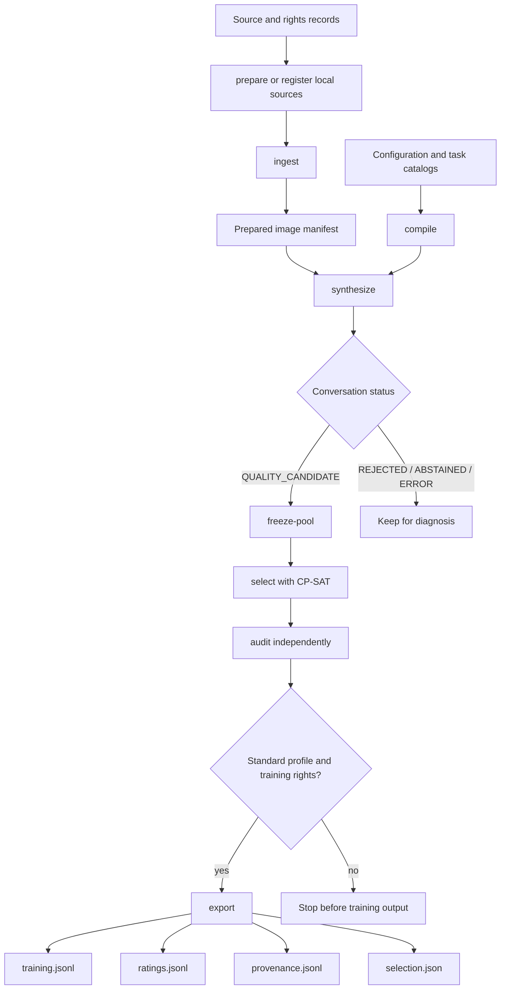

# Pixelogue pipeline guide

A fluent answer can still name the wrong object, repeat an earlier question, or come from an image that cannot be used for training. Pixelogue treats those as separate problems. It checks the image, builds a conversation one turn at a time, records the evidence behind each decision, and exports only records that pass the later selection and audit steps.

This guide follows one image through that path. Read the pages in order the first time.

## Contents

1. **You are here — map and vocabulary.** Learn what moves through the pipeline and where each file belongs.
2. **[Prepare images](data-and-ingestion.md).** Acquire or register images, check their usage terms, normalize pixels, group visual copies, and inspect the prepared manifest.
3. **[Generate and evaluate dialogue](generation-and-evaluation.md).** Follow instruction choice, question generation, pre-answer checks, answer generation, claim checks, repair, and turn commit.
4. **[Select and export](selection-and-export.md).** Freeze the accepted pool, solve diversity constraints, audit the result, and write the four-file bundle.
5. **[Inspect artifacts and examples](artifact-examples.md).** Connect real intermediate responses from the Qwen3.5 pilot to final conversation and training-record shapes.

For a shorter command-focused path, use the [CPU quickstart](../quickstart.md) and the [workflow reference](../workflow.md). The [recovery guide](../recovery-and-ci.md) explains backups and integrity checks.

Japanese readers can start with the [Japanese contents page](README_ja.md).

## The complete path

The arrows matter. `synthesize` does not write a training corpus. It writes a richer conversation record that still contains private evaluation information. `export` is the boundary that removes that information from public training content.

## Four kinds of information

The pipeline is easier to understand when its data is separated by purpose.

| Kind | Examples | Who needs it? |
|---|---|---|
| Public dialogue | User questions and assistant answers | A future training consumer |
| Image provenance | Source ID, rights record, hashes, visual-copy group | The data operator and auditor |
| Model evidence | Visible capabilities, candidate instructions, extracted claims | Pipeline decisions and diagnosis |
| Operational state | Request hashes, token counts, retries, SQLite events | Resume, budget control, and audit |

Only the first kind enters `training.jsonl`. Ratings and provenance are written to separate files. Raw model requests and responses stay in the local run store.

## Terms used throughout the guide

**Source record** : A row that identifies an input image, its local path, dataset, intended purpose, and rights record.

**Rights record** : A row that states whether processing, training, question-answer redistribution, and image redistribution are allowed. Pixelogue checks it before decoding the image.

**Image artifact** : The normalized image view and stable identifiers produced by `ingest`. Here, “artifact” means a saved result with a known identity; it does not mean an accidental visual defect.

**Visual group** : Images treated as the same or near copies. A validation image and its copy must not land on opposite sides of the training boundary.

**Turn** : One user question and one assistant answer. A quality-candidate conversation has two to six committed turns.

**Public history** : Only the committed questions and answers before the current turn. Future turns and rejected attempts are absent.

**Requirement** : An explicit instruction in public user text, such as “answer in one sentence.” Each requirement points back to an exact text span so an evaluator cannot silently rewrite it.

**Gate** : A decision point that must pass before the pipeline continues. A gate preserves more information than a Boolean: it can distinguish a clear failure, insufficient evidence, and an execution error.

**Run store** : A local SQLite WAL database plus content-addressed files for one run. “Content-addressed” means the file name is derived from its content hash, making later modification detectable.

**Profile** : A named operating mode. `pilot` is for bounded validation and cannot export training data; `standard` is for a reviewed training-data run.

**Pool** : The fixed set of quality-candidate conversations from which the selector may choose final records.

**Processor** : The image preprocessor paired with a model. Its revision and pixel limits are recorded separately from the instruction selector.

**Endpoint** : The local HTTP address where Pixelogue sends model requests, such as `http://127.0.0.1:8002/v1`.

## Status is part of the result

The pipeline does not force every image into a usable conversation.

| Status | Meaning | Can enter the selection pool? |
|---|---|---|
| `QUALITY_CANDIDATE` | Two to six turns were committed and all required gates passed | Yes, if the source is training-eligible |
| `REJECTED` | A clear content or quality condition failed | No |
| `ABSTAINED` | The judges could not establish enough evidence or agreement | No |
| `ERROR` | Transport, schema, storage, or another execution boundary failed | No |

A high rejection rate can reveal a model or prompt problem, but a rejected record is not the same as a crashed run. Keep the distinction when reading summaries.

## Which model does what?

The standard configuration uses `Qwen/Qwen3.5-2B` to select an instruction, `Qwen/Qwen3.8-27B` for generator and evaluator role A, and `google/gemma-4-31B-it` for role B. Pixelogue sends the evaluation calls separately and hides each verdict from the other model.

The temporary `configs/pilot.yaml` override points roles A and B to one `Qwen/Qwen3.5-9B` endpoint so the current validation run fits on one GPU. It checks the pipeline path without providing two model lineages. Pilot results must state that limitation and must not be presented as results from the standard model pair.

The optional `Qwen/Qwen3.6-35B-A3B` selector is used only when a copied configuration explicitly sets `models.active_selector: alternative`. It is never an automatic fallback. The training-side image processor is separately pinned to `Qwen/Qwen3-VL-8B-Instruct`; changing the selector does not change that lock.
