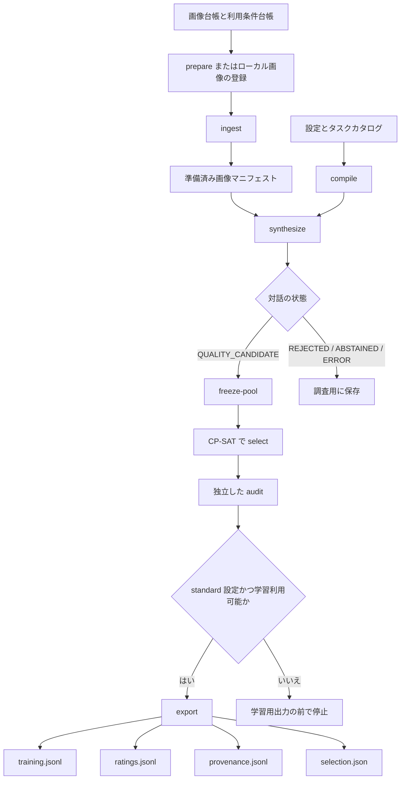

# Pixelogue パイプラインガイド

文章として自然な回答でも、画像とは違う物を指していたり、前の質問を繰り返していたりすることがあります。画像自体を学習に使えない場合もあります。Pixelogue はこれらを別々の問題として検査し、判断の根拠を残しながら、1往復ずつ対話を組み立てます。

このガイドでは、1枚の画像が各処理を通る様子を順にたどります。初めて読むときは、次の順序が分かりやすいでしょう。

## 目次

1. **現在のページ — 全体像と用語。** パイプラインを流れる情報と、各ファイルの役割を確認します。
2. **[画像を準備する](data-and-ingestion_ja.md)。** 画像の取得または登録、利用条件の検査、画素の正規化、類似画像のグループ化、準備済みマニフェストの確認を行います。
3. **[対話を生成して評価する](generation-and-evaluation_ja.md)。** 指示選択から質問、回答、主張の検査、修復、往復の確定までを追います。
4. **[選抜して出力する](selection-and-export_ja.md)。** 候補集合の固定、条件付き選抜、独立監査、4ファイルへの出力を説明します。
5. **[生成物の実例を確認する](artifact-examples_ja.md)。** Qwen3.5 pilotで得た中間応答を、最終対話と学習用レコードの構造へつなげます。

まずコマンドだけを試したい場合は、[CPUクイックスタート](../quickstart_ja.md)と[ワークフロー早見表](../workflow_ja.md)を参照してください。中断後の確認とバックアップは[復旧ガイド](../recovery-and-ci_ja.md)にまとめています。

英語版は [English contents](README.md) から読めます。

## 処理の全体像

`synthesize` の出力は、そのまま学習データになるわけではありません。この段階の対話レコードには、評価理由などの内部情報も入っています。公開してよい会話だけを分離する境界が `export` です。

## 4種類の情報を分けて考える

| 種類 | 例 | 主な利用者 |
|---|---|---|
| 公開対話 | ユーザーの質問、アシスタントの回答 | 学習データの利用者 |
| 画像の来歴 | 取得元、利用条件、ハッシュ、類似画像グループ | データ管理者、監査担当者 |
| モデルによる判断材料 | 画像から確認できる能力、指示候補、回答内の主張 | パイプラインの判定、問題調査 |
| 実行状態 | 要求ハッシュ、トークン数、再試行、SQLiteのイベント | 再開、予算管理、監査 |

`training.jsonl` に入るのは公開対話だけです。評価と来歴は別ファイルへ分けます。モデルへの要求と生の応答は、ローカルのrun storeに保存します。

## このガイドで使う用語

**画像台帳（source record）**: 入力画像のローカルパス、データセット、用途、対応する利用条件を記録した1行です。

**利用条件台帳（rights record）**: 処理、学習、質問回答の再配布、画像自体の再配布が許されるかを記録します。画像を展開する前にPixelogueが検査します。

**画像アーティファクト**: `ingest` が作る、正規化済み画像と安定した識別情報です。ここでのアーティファクトは「保存された生成物」という意味で、画像の乱れを指す言葉ではありません。

**類似画像グループ（visual group）**: 同一画像または近似画像として、まとめて扱う単位です。検証画像とその複製が学習側へ分かれてしまうことを防ぎます。

**turn（往復）**: 1つの質問と、それに対する1つの回答です。学習候補となる対話には、確定済みの往復が2〜6個必要です。

**公開履歴**: 現在の往復より前に確定した質問と回答だけを指します。未来の往復や、棄却した試行は含みません。

**公開要求**: 「1文で答えてください」のように、ユーザーが公開文中で明示した条件です。各要求は元の文章中の正確な位置を参照するため、評価時に別の条件へすり替えられません。

**gate**: 次の処理へ進むために通過する必要がある判定点です。単純な真偽値ではなく、明確な不合格、判断に足る根拠の不足、実行時エラーを区別します。

**run store（実行記録）**: 1回の実行に対応するSQLite WALデータベースと、内容ハッシュで管理するファイル群です。内容からファイル名を決めるため、後から書き換えられた場合に検出できます。

**プロファイル**: 実行目的を表す設定です。`pilot` は範囲を限定した動作確認用で、学習用には出力できません。`standard` は、内容を確認した学習データ生成に使います。

**pool（候補集合）**: 品質候補の中から最終レコードを選ぶために、内容を固定した候補の集まりです。

**画像プロセッサー**: モデルへ渡す前に画像を整える処理です。revisionと画素数の上下限を、指示選択器とは別に記録します。

**エンドポイント**: Pixelogueがモデルへ要求を送るローカルHTTPアドレスです。例えば`http://127.0.0.1:8002/v1` を使います。

## 状態も大切な出力である

Pixelogueは、すべての画像を無理に学習候補へ変換しません。

| 状態 | 意味 | 選抜候補にできるか |
|---|---|---|
| `QUALITY_CANDIDATE` | 2〜6往復が確定し、必要な検査をすべて通過した | 画像を学習利用できる場合のみ可能 |
| `REJECTED` | 内容や品質の条件に明確に違反した | 不可 |
| `ABSTAINED` | 評価器が十分な根拠または合意を得られなかった | 不可 |
| `ERROR` | 通信、Schema、保存などの実行境界で失敗した | 不可 |

棄却が多ければ、モデルやプロンプトに改善の余地があるかもしれません。ただし、品質判定による棄却と実行失敗は別の状態です。集計を見るときも混同しないようにします。

## 各モデルの役割

standard設定では、`Qwen/Qwen3.5-2B` が指示を選び、`Qwen/Qwen3.8-27B` が生成器・評価器A、`google/gemma-4-31B-it` が生成器・評価器Bを担当します。評価要求は別々に送り、互いの判定を相手のモデルへ見せません。

一時的な `configs/pilot.yaml` では、現在の検証を1枚のGPUに収めるため、AとBを1つの `Qwen/Qwen3.5-9B` エンドポイントへ割り当てています。この構成で確認できるのはパイプラインの経路であり、異なるモデル系列による評価ではありません。pilotの結果にはこの制約を記録し、standardモデルの結果として扱いません。

`Qwen/Qwen3.6-35B-A3B` は、設定のコピーで `models.active_selector: alternative` と明示した場合だけ使う選択肢です。失敗時の自動切り替え先ではありません。学習側の画像プロセッサーは`Qwen/Qwen3-VL-8B-Instruct` に別途固定されており、選択器を変えても連動して変わりません。
