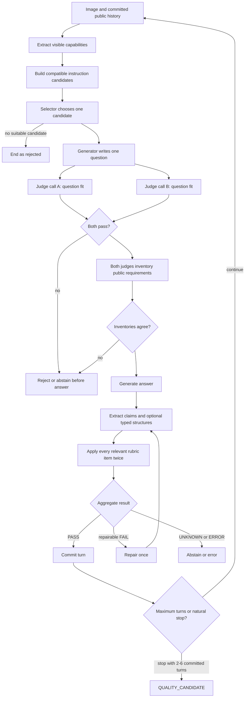

# Generate and evaluate dialogue

The visible output of one turn is only a question and an answer. Reaching that pair takes several checks, and their order prevents later information from changing an earlier decision.

[Previous: prepare images](data-and-ingestion.md) · [Back to contents](README.md) · [Next: select and export](selection-and-export.md)

## 1. Start from healthy model servers

Long GPU processes must run in `tmux`. Inspect `nvidia-smi`, choose an idle device explicitly, start the larger server first, and wait for `/v1/models` before starting the smaller selector. The following files belong to the temporary one-GPU pilot, which substitutes Qwen3.5-9B for the standard Qwen3.8-27B and Gemma 4 31B pair:

```text
runtime/vllm/generator-qwen35-9b.yaml  -> port 8002
runtime/vllm/selector-default.yaml     -> port 8000
```

Check both through Pixelogue:

```sh
uv run --locked pixelogue doctor \
  --config configs/pilot.yaml \
  --check-servers
```

A healthy model list proves that the server is reachable. Before a long run, send one real image through the same structured-output schemas as the full pipeline. A server can answer `/v1/models` and still reject a JSON Schema used for guided decoding.

## 2. Start synthesis

```sh
uv run --locked pixelogue synthesize \
  --config configs/pilot.yaml \
  --images artifacts/prepared-open-images/images.jsonl \
  --artifact-root artifacts/prepared-open-images \
  --run-id open-images-pilot-001 \
  --output artifacts/open-images-pilot-001/conversations.jsonl
```

The checked-in profiles allow four images in flight through `runtime.max_concurrent_images`. This gives vLLM independent requests to combine with continuous batching. `--workers` can override the value for a measured run. Pixelogue preserves the scheduled input order in `conversations.jsonl`, while every turn within one conversation remains sequential because it depends on committed public history.

Use a new run ID after changing configuration, code, prompts, catalogs, or schemas. The active run store records a configuration hash, but it does not yet bind every source and prompt change into that identity.

Before processing the first image, Pixelogue makes two exact schedules:

- a target-language schedule from the configured weights;
- a generator-role schedule from `generation_allocation`.

The configured count is exact over the batch. Random seeds only determine the stable order. Once a generator role is assigned, that role handles question generation, answer generation, and the one allowed repair for the complete conversation.

After each image, the command atomically rewrites `conversations.jsonl` and its summary. A later image can fail without erasing completed records.

## 3. Build one turn



### Step 1: extract visible capabilities

The generation model receives the image and a fixed capability vocabulary. It may report facts such as `readable_text`, `countable_entities`, or `spatial_relation`, along with a bounded visible scope. These are provisional observations. They do not become public dialogue and do not prove that a specific question is correct.

The controller rejects unknown and repeated capability keys. Definitions are intentionally strict: for example, aligned repeated objects do not establish an explicit `visible_mapping`.

### Step 2: build instruction candidates

The controller matches reported capabilities to the checked-in task catalog. Each candidate has a stable ID, task ID, family, profile, visible scope, summary, and required capabilities.

A candidate is an operation, not a finished question. `visible_count` might later become “How many red squares are there?”, while `attribute_lookup` might become “What colour is the left square?”

### Step 3: select one instruction

The active selector receives only:

- the image;
- the target language;
- the exact committed public history;
- the current candidate set.

It does not receive an answer, a future turn, dataset labels, fixture keys, or another model's decision. It returns one candidate ID or `null` with a short internal reason. An unknown ID is rejected. `null` ends the current plan; Pixelogue does not switch to the alternative selector.

### Step 4: write and check the question

The assigned generation role turns the selected operation into one public question. Both evaluator roles then check three points before any answer exists:

1. the question has a visible or public-history anchor;
2. it performs the selected operation coherently;
3. it is useful and does not repeat an answered request.

Each role returns `MET`, `NOT_MET`, or `UNKNOWN`. A clear negative rejects the turn. Missing evidence or disagreement causes abstention. An answer is never generated for a question that did not pass.

Before those model calls, the controller applies two narrow checks that do not require visual judgment. It rejects a question that is identical to an earlier user question after Unicode, case, whitespace, and final-punctuation normalization. It also rejects a substantial echo of Pixelogue's private model instructions. The rejected text and reason are stored for diagnosis. Paraphrases and questions with different meaning still go to both image-aware evaluators; the controller does not guess semantic similarity from words alone.

### Step 5: freeze public requirements before the answer

Both evaluator calls independently list every explicit requirement in public user text. Each item stores its kind, lifetime, source message ID, and exact character offsets. The controller verifies that the cited span exists unchanged.

This matters because a fluent answer can make a forgotten requirement less noticeable. Freezing the list first prevents evaluators from weakening the request after seeing the answer. The two lists must agree before generation continues.

A normal question applies to the current turn. A requirement persists only when the user explicitly extends it to later turns, as in “From now on, answer in one sentence.”

### Step 6: generate the answer

The same conversation generator sees the image, exact committed history, current question, target language, and agreed active requirements. It returns public text or an internal unsupported reason. Candidate IDs, evaluator names, and private reasons are forbidden in public text.

### Step 7: decompose and evaluate the answer

Both evaluator roles extract every factual claim as an exact span in the answer. Pixelogue derives claim IDs from validated content rather than asking the model to invent them. If a quoted phrase occurs exactly once but its offsets are wrong, the controller can correct them deterministically; ambiguous spans remain invalid.

The controller then instantiates every applicable rubric item. The checks cover question and answer clarity, relevance, visible grounding, claim correctness and coverage, uncertainty, safety, target language, history use, and public naturalness.

Being a later turn activates consistency and turn-progress checks. It does not by itself activate `H_BINDING` or `H_WITNESS`. `H_BINDING` requires an actual resolved reference to prior public state; the current ledger supplies it for persistent requirements from an earlier user message and passes that requirement to the evaluator. `H_WITNESS` requires the coordinator to designate and provide a history-dependency witness. The current synthesis path does not yet produce that witness artifact, so this item remains inapplicable instead of being guessed from the turn number. This distinction prevents an unrelated second question about the same image from being judged as though it claimed a strong dependency on the first answer.

Natural-language-only criteria are instantiated only when the answer contains a Unicode letter. A numeric answer such as `42` still receives the always-applicable factual, relevance, safety, and public-usability checks, but it is not sent through prose clarity, prose redundancy, or answer-language gates. Units such as `kg` contain letters and therefore keep those language checks enabled.

Two additional paths avoid relying on a prose verdict alone:

- For grounded arithmetic, both roles extract typed operands and units. The controller recomputes an agreed allowlisted operation without binary floating-point arithmetic.
- For exhaustive count or set questions, both roles bind expected and reported members. The controller compares the complete sets and preserves duplicates for diagnosis.

Evaluator calls are blind: neither receives the other verdict or the generator-role name. The standard profile uses Qwen3.8-27B for role A and Gemma 4 31B for role B. In the temporary one-GPU pilot, both roles use the same Qwen3.5-9B endpoint. Pixelogue bypasses the result cache for the second logical call so two requests are made, while still reporting the lack of model-lineage diversity.

### Step 8: repair once or commit

If the aggregate is a clear, repairable `FAIL`, the same generation role may replace the answer once. All claim extraction, typed checks, and rubric evaluation then run again. A repaired answer never inherits the old pass results.

Only a `PASS` turn is committed. Its question and answer become immutable public history for the next turn. If generation stops before two committed turns, the conversation cannot become a `QUALITY_CANDIDATE`.

## 4. Consensus does not average uncertainty away

At a required gate, two `MET` verdicts pass. Any `NOT_MET` gives a clear failure. `UNKNOWN` remains unknown, and an execution error remains an error. Pixelogue does not turn a weak average into a pass.

The final conversation status records where the image ended:

- `QUALITY_CANDIDATE`: two to six committed turns and no terminal failed turn;
- `REJECTED`: a definite quality failure or unsuitable plan;
- `ABSTAINED`: insufficient evidence or evaluator disagreement;
- `ERROR`: model transport, structured output, storage, or another execution failure.

## 5. What the run store preserves

For each model call, the local store writes the model lock, stage, request hash, request artifact, response artifact, token counts, and status. Calls that fail schema validation are recorded as `INVALID` with their raw response artifact so the failure can be inspected.

The SQLite database is the index. Request and response bodies live in content-addressed paths such as:

```text
/var/tmp/pixelogue/<run-id>/
├── run.sqlite3
├── run.sqlite3-wal
├── run.sqlite3-shm
└── artifacts/
    ├── requests/08/<sha256>
    ├── responses/24/<sha256>
    ├── public-text-rejections/6c/<sha256>
    └── turns/ab/<sha256>
```

Do not publish this directory as training data. It contains internal prompts, evaluation reasons, and operational information.

## 6. Watch a long run without guessing

Check more than process existence:

```sh
tmux list-windows -t pixelogue-qwen35-pilot \
  -F '#{window_index}:#{window_name} pane_dead=#{pane_dead}'
wc -l artifacts/open-images-pilot-001/conversations.jsonl
cat artifacts/open-images-pilot-001/conversations.summary.json
nvidia-smi
```

An output row may be `ERROR`, so a growing line count is only one signal. Confirm that model calls complete, errors do not repeat across every image, committed turns appear, and reserved output tokens return to zero when the run ends.

The run database contains per-request duration and token counts for new runs. Generate a stage and model summary with:

```sh
uv run --locked pixelogue profile \
  --database /var/tmp/pixelogue/open-images-pilot-001/run.sqlite3 \
  --output artifacts/open-images-pilot-001/inference-profile.json
```
