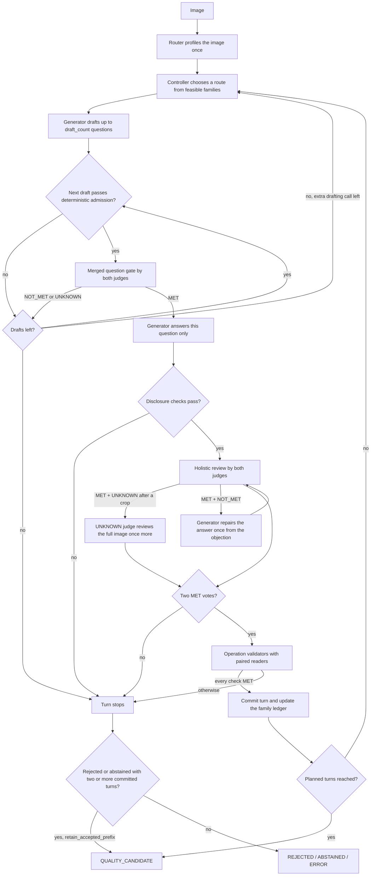

# Generate and evaluate dialogue

The visible output of one turn is only a question and an answer. Reaching that pair takes several checks, and their order matters: no answer is written before its question has passed, and no judge ever sees the other judge's vote.

[Previous: prepare images](data-and-ingestion.md) · [Back to contents](README.md) · [Next: select and export](selection-and-export.md)

## 1. Start from healthy model servers

Long GPU processes must run in `tmux`. Inspect `nvidia-smi`, choose an idle device explicitly, start the larger server first, and wait for `/v1/models` before starting the smaller router. The following files belong to the temporary one-GPU pilot, which substitutes Qwen3.5-9B for the standard Qwen3.8-27B and Gemma 4 31B pair and keeps a separate Qwen3.5-2B router:

```text
runtime/vllm/generator-qwen35-9b.yaml  -> port 8002
runtime/vllm/router-default.yaml       -> port 8000
```

Every generator server file accepts two images per prompt, because a judge can receive the complete image and a crop together. The router server accepts one image.

Check both through Pixelogue:

```sh
uv run --locked pixelogue doctor \
  --config configs/pilot.yaml \
  --check-servers
```

A healthy model list proves that the server is reachable. Before a long run, send one real image through the same structured-output schemas as the full pipeline. A server can answer `/v1/models` and still reject a JSON Schema used for guided decoding.

## 2. Start synthesis

```sh
uv run --locked pixelogue synthesize \
  --config configs/pilot.yaml \
  --images artifacts/prepared-open-images/images.jsonl \
  --artifact-root artifacts/prepared-open-images \
  --run-id open-images-pilot-001 \
  --output artifacts/open-images-pilot-001/conversations.jsonl
```

The standard, regular pilot and one-GPU paired pilot profiles allow four images in flight through `runtime.max_concurrent_images`. The one-GPU paired profiles also refill a finished slot immediately (`runtime.refill_completed_images: true`). On one GPU serving the standard pair and router with refill, four images took about 0.71 times the wall time per image of two with a similar yield; eight saved only about 7% more and doubled the time each image waited. This gives vLLM independent requests to combine with continuous batching. `--workers` may reduce the value for a measured run but cannot exceed the configured bound. Use a separate configuration with an explicit bound for a higher-concurrency comparison. Pixelogue preserves the scheduled input order in `conversations.jsonl`, while every turn within one conversation remains sequential because it depends on committed public history. Within a turn, the two judges' calls run concurrently, and so do the two readers of each validator; database writes stay serialized.

For a balanced 1/2/4-worker study, save the six runs and frozen `experiment-plan.json`/`progress.json` together, then run `python validation/compare_concurrency_runs.py EXPERIMENT_DIR`. The JSON, CSV, and Markdown summaries validate image order, model assignments, config hashes, and turn counts. Automatic quality candidates per synthesis GPU hour are descriptive; human-approved output per allocated GPU hour remains unmeasured until independent ballots are resolved.

For a focused diagnostic run, repeat `--source-id ID` to select exact sources from the already rights-checked prepared manifest. The full manifest must still match `images.jsonl`; unknown or repeated IDs fail before any model call. Use a new run ID for each selected set.

After a run, write private per-image and per-turn diagnostics from the saved request records:

```sh
uv run --locked pixelogue run-diagnostics \
  --config configs/pilot.yaml \
  --run-id open-images-pilot-001 \
  --conversations artifacts/open-images-pilot-001/conversations.jsonl \
  --output-stem artifacts/open-images-pilot-001/diagnostics
```

This writes JSON, CSV, and Markdown. The report counts attempted turns, committed turns, and completed quality-candidate conversations separately. A turn is attempted when it has a saved turn, model call, or explicit stop record; older runs without those records may undercount attempts. The report also includes reached stages, malformed calls, retries, private stop records, elapsed model-call time, and recorded tokens. Each structured-output contract failure and its next correction prompt is saved as a private `structured-output-failures` artifact. Failed calls may lack token usage, and cost remains unknown without a recorded price schedule. The report's binding-rejection fields are filled only for runs made by the retired scoped planner.
Completed quality candidates have no stop stage or stop reason; earlier corrected attempts remain visible in the attempt records.

Use a new run ID after changing configuration, code, prompts, catalogs, or schemas. The configuration hash includes package Python and resource files, selected lock files, Schemas, pinned model and processor settings, and the configured input manifest. `synthesize` also binds the prepared rights-checked manifest and selected image records to its run contract; a conflicting resume is rejected.

Before processing the first image, Pixelogue makes two exact schedules:

- a target-language schedule from the configured weights;
- a generator-role schedule from `generation_allocation`.

The configured count is exact over the batch. Random seeds only determine the stable order. Once a generator role is assigned, that role drafts the questions, writes the answers, and makes the one allowed answer repair for the complete conversation. Both generator models judge every turn, whichever of them wrote it.

Each finished conversation is appended to `conversations.jsonl` in input order and flushed. The summary is refreshed after the first row, every 100 rows, and on exit, when `conversations.operations.json` is also written. A later image can fail without erasing completed rows.

## 3. Build one conversation

Each image receives a planned length of two to six turns, fixed by its image ID and the seed (reference weights 4/4/1/1/1 for 2, 3, 4, 5 and 6 turns). The router profiles the image once; then every turn follows the same path. The loop ends after the planned number of turns or at the first turn that is not committed.


```mermaid
flowchart TD
    A[Image] --> B[Router profiles the image once]
    B --> C[Controller chooses a route from feasible families]
    C --> D[Generator drafts up to draft_count questions]
    D --> E{Next draft passes deterministic admission?}
    E -->|no| F{Drafts left?}
    E -->|yes| G[Merged question gate by both judges]
    G -->|NOT_MET or UNKNOWN| F
    F -->|yes| E
    F -->|no, extra drafting call left| C
    F -->|no| X[Turn stops]
    G -->|MET| H[Generator answers this question only]
    H --> I{Disclosure checks pass?}
    I -->|no| X
    I -->|yes| J[Holistic review by both judges]
    J -->|MET + UNKNOWN after a crop| K[UNKNOWN judge reviews the full image once more]
    J -->|MET + NOT_MET| M[Generator repairs the answer once from the objection]
    M --> J
    K --> L
    J --> L{Two MET votes?}
    L -->|no| X
    L -->|yes| N[Operation validators with paired readers]
    N -->|every check MET| O[Commit turn and update the family ledger]
    N -->|otherwise| X
    O --> P{Planned turns reached?}
    P -->|no| C
    P -->|yes| Q[QUALITY_CANDIDATE]
    X --> R{Rejected or abstained with two or more committed turns?}
    R -->|yes, retain_accepted_prefix| Q
    R -->|no| S[REJECTED / ABSTAINED / ERROR]
```

### Step 1: profile the image once

The router (`models.router`, generator A's own `Qwen/Qwen3.8-27B` server; `Qwen/Qwen3.5-2B` in the temporary pilot) receives the image and a description of every task family that has an available operation: the family ID, its label, and its operation names. It returns `image_kind`, `readable_text`, `supported_families`, and a short reason. The decoder accepts only the listed family IDs. The router never sees a question, an answer, public history, or a dataset label, and it writes no public text.

Routing uses `supported_families` and whether `image_kind` is `screen`. If the profile is still malformed after the bounded retries, a private `image-profile-abstentions` record is written and routing falls back to fixed broad families; the image continues.

### Step 2: route the turn

For each turn, the controller offers one primary family with up to four operations and one secondary family with up to two:

1. **Available operations.** Drafting offers the 71 core tasks whose validators are registered. In the first `tasks.anchor_turns` turns (default 2), only the 25 light tasks are offered: those verified by the two blind reviews, evidence binding, or transcript alignment alone. These turns decide whether the conversation reaches two committed turns, and structured extraction verifiers abstain more often.
2. **Feasible families.** These are the profiled families that have an available operation. `screen_ui` stays feasible only for an image profiled as `screen`. When none remain, or the profile is missing, the fallback families `visual_description`, `text_reading`, `reference_spatial`, `counting_and_sets` and `evidence_verification` are used.
3. **Primary family.** Families not yet used by the conversation's committed turns come first. Among them, the controller picks the largest deficit between the family's target share (`tasks.family_targets`, uniform by default) and its share of all turns committed so far in the run. This run-wide family ledger is shared by images processed concurrently and is updated after every commit. The secondary family is the best remaining feasible family by the same preferences.
4. **Operations.** Within a family, operations not yet used in the conversation come first, then those with the fewest committed turns in the run after division by `tasks.task_weights`. The default weight is 0.25 for table, chart and document structure reconstruction and 1 for every other operation, so whole-structure reconstructions are offered less often.

Ties use a SHA-256 rank of the seed, image, turn, and candidate value. Each route is stored in the `turn_route` table under the conversation, turn index, public-history hash, and drafting-call index. A resumed turn therefore receives the same offer even though other images may have changed the ledger in the meantime.

### Step 3: draft questions

The conversation's generator receives the image, the exact committed public history, the target language, the offered operation contracts in route order (each with the task's definition, parameter contract and any answer format), the family plan, the private fact keys of earlier committed turns, and `tasks.draft_count` (default 2). It returns at most that many drafts; the decoder also restricts each `task_id` to the offered operations. Every draft has:

- `task_id`: one offered operation;
- `question`: the public user question;
- `target`: a short public locator of the subject, which never contains the answer;
- `public_parameters`: every required parameter of the task, as an array of name and value objects; a list value is a JSON array and an integer a JSON number;
- `scope_region` and `target_region`: the region the draft used and the subject inside it, as fractions from 0 to 1 of the image width and height with left < right and top < bottom;
- `fact_key`: a private subject and dimension, such as “dog on the left” and “fur color”, never the value.

The instruction states both formats explicitly, and every region schema keeps left and top below 1 and right and bottom above 0: without them, Gemma 4 wrote regions on its native 0-1000 scale, which constrained decoding clamped into empty or inverted boxes such as a left edge of 1.0. An empty draft list is a valid abstention. If every draft in a response breaks its operation contract, the call is retried with correction feedback within `runtime.structured_output_max_attempts`; a retry after a schema mismatch or repetition stop restates the region and parameter formats. A response that stays malformed is recorded in `draft-abstentions` and counts as no drafts. Each valid response is saved with its route in `question-drafts`.

### Step 4: admit drafts deterministically

Drafts are examined in order. The controller first converts a draft into an operation contract with `origin: direct` and a private `request_key` built from its fact key; spelling variants such as `colour`/`color` and articles do not create a new fact. For text transcription, including several text blocks and code, the whole drafted scope becomes the text region.

A draft is rejected before any judge call when:

- its operation was not offered or its public parameters break the catalog contract (unknown or missing names, a value of the wrong kind or outside the allowed values, scene categories without two to five distinct options); these go to `draft-rejections`;
- the question gate already rejected the same normalized question in this turn;
- it reproduces a substantial part of a private model instruction;
- it contains a controller reference such as `scope_0`, `evidence_…`, or “selected region”;
- it repeats an earlier user question after normalization;
- its fact key matches a committed turn of the conversation;
- a `visible_action` question asks what a subject can or could do;
- a `text_transcription` question locates its text relatively, for example “above” or “next to”;
- a `scene_categorization` question does not state every listed option.

Every reason after the first is saved with the rejected text in `public-text-rejections`. Rejected drafts stay private and never reach a later drafting call.

### Step 5: gate the question with both judges

Both generator models act as blind judges and make one `question_gate` call each, concurrently. A judge sees the image views, the public history, the drafted operation contract, all 78 task definitions, and the question. No answer exists yet. Each judge returns three verdicts and a reason, and only then its own label for the operation the question actually asks for (`realized_task_id`, or null):

1. `local_anchor`: the question refers to something that exists in the image or committed history, and to the bound subject when a target region is given;
2. `operation_coherent`: it realizes the drafted operation exactly, with every public parameter and eligibility check;
3. `useful_request`: it neither repeats an answered request nor states its own answer.

A judge's three verdicts reduce to `MET` only when all are `MET`, and to `NOT_MET` when any is `NOT_MET`. The two labels are compared under `evaluation.question_gate_label_policy`:

| Label outcome | `strict` | `same_contract` (default) |
|---|---|---|
| Both labels name the drafted operation | `MET` (`exact`) | `MET` (`exact`) |
| One label names the drafted operation; the other names an operation with identical verification contracts | `UNKNOWN` (`label_unresolved`) | `MET` (`same_contract`) |
| Both labels name the same neighbor with identical contracts, and the draft already carries that operation's required public choices | `NOT_MET` (`label_mismatch`) | `MET`; the turn is relabeled (`relabel`) |
| Both labels name the same other operation | `NOT_MET` (`label_mismatch`) | `NOT_MET` (`label_mismatch`) |
| Any other disagreement, or a null label | `UNKNOWN` (`label_unresolved`) | `UNKNOWN` (`label_unresolved`) |

The question passes only when the label outcome is `MET` and both judges' reduced verdicts are `MET`. A clear rejection needs `NOT_MET` from both judges or an agreed label mismatch; anything else short of a pass is uncertainty. Either way, the next draft is examined. When no draft of the call passes, one more drafting call (`tasks.extra_draft_calls_per_turn`, default 1) is routed with a preference for families that the first call did not offer. If that call fails too, the turn stops: abstained after an uncertain last gate decision, rejected otherwise. Each decision, with both votes, is saved in `question-gate-decisions`.

**What the judges see.** For object identification, attribute lookup and text transcription with a region smaller than the image, the controller cuts an exact crop of the target region, or of the scope region when no target region exists. Rounding never enlarges the crop, and it records its source view and coordinates in `focus-views`. With `evaluation.judge_views: full_and_crop` (default), judges receive the complete image first and the crop second; they judge the local subject inside the crop and use the complete image only for context. With `crop`, they receive the crop alone. Other operations always use the complete image. A crop without a whole pixel is recorded in `focus-view-abstentions`; under `full_and_crop` the judges then see the complete image, under `crop` the decision is `UNKNOWN`, and in both modes the turn cannot pass its operation checks. Generators always see the complete image.

### Step 6: answer the first gated question

Only the first draft that passes admission and the question gate is answered. The same generator receives the image, exact history, question, target language, and the expected operation contract, and returns public text or an internal reason for not answering (`answer_generation`, budget `tasks.answer_max_tokens`, default 1024). If the generator declines, the turn stops as rejected. A turn answers at most one question, so a failed answer is never replaced by an easier question in the same turn.

Before review, the controller rejects an answer that reproduces a private instruction, a paraphrased question whose answer repeats an earlier substantial answer, and answers that add nothing to their own question: an identification label or transcription already in the question, an action already stated in the question, or a UI location that only repeats its public target. The text and reason go to `public-text-rejections`, and the turn stops.

### Step 7: review the answer as a whole

Both judges make one blind `holistic_review` call each, concurrently, with the expected operation contract and the views described in Step 5. Each returns one concrete reason of at most 25 words covering image facts, fulfillment of the request, consistency with history, target language, explicit formats, and safety, and then `MET`, `NOT_MET`, or `UNKNOWN`. The reason comes first in the schema because constrained decoding writes fields in that order: on 211 judge pairs that had split in a baseline run, a verdict written first left 175 still split or unknown and a reason written first 93, while the 33 answers the GPT reference rejected were accepted equally often (31 times) in both orders. Empty text, private-instruction echoes, internal references, and repeated questions fail in the controller without a judge call.

Two `MET` votes pass and two `NOT_MET` votes fail. Every other pair is uncertain and allows at most one follow-up:

- **Tie-break** (`evaluation.holistic_tiebreak: full_view`, default). When one judge says `MET` and the other `UNKNOWN` after seeing a crop, the `UNKNOWN` judge reviews once more with the complete image alone. The pair is then decided again without averaging.
- **Repair** (`evaluation.repair_once: true`, default). When one judge says `MET` and the other `NOT_MET`, the generator replaces the answer once (`answer_repair`). It receives the original answer and the objecting judge's reason, never a verdict or the other judge's response. The new answer must pass the same deterministic checks; then both judges review it from scratch. A tie-break is still possible in that review, but a second repair is not. The original answer, its rating, and the objection are saved in `answer-attempts`.

Each holistic decision, including any tie-break vote and repair objection, is saved in `rating-decisions`.

### Step 8: run the operation validators

After a passing review, every verification contract of the operation runs, except `dual_visual_review`, which the two holistic reviews already satisfy. Each validator asks both judge models for the same independent reading, and neither reader sees the other's output. Source readers (`*_source`) see the image, question, history, and operation but not the answer; answer parsers (`*_answer`) see the answer but not the image; set and arithmetic inventories, transcript alignment, and evidence-binding reviews see both. The second reader's identical request starts immediately, so the two readings overlap. The controller then compares sets, arithmetic, tables, charts, documents, formulas, graphs, scales, geometry, patterns, transcripts, and evidence bindings. Uncertain, incomplete, or disagreeing readings abstain, and no reading is completed from the candidate answer. Each result is saved in `operation-checks`.

Verbatim transcription readers receive the original image so they can detect text continuing beyond the bound rectangle; the controller requires the whole requested unit to fit inside it. Exhaustive count and set questions use two inventories of expected and reported members or per-category counts; unreadable scope is never a zero count. Table, table-lookup, chart, graph, and specialist source readers use `tasks.source_max_tokens` (default 4096); other validator calls use 2,048 tokens. A chart or graph reading that stops at its limit is retried with up to twice the budget, capped at 8,192 tokens unless the configured budget is already higher. A table reading keeps its budget and must return `UNKNOWN` when the complete table does not fit.

### Step 9: commit and continue

A turn is committed only when the holistic review and every operation check pass. The turn artifact (`turns`) keeps the operation contract with `origin: direct` and its private `request_key`, the public question and answer, the history hash, the generator, the router (in the legacy field `selector_model`), and the rating. The commit is written to `turn_commit`, the family ledger counts the operation, and the question and answer become immutable public history for the next turn.

When the loop stops early, the stop stage and reason go to `conversation-stop-reasons`. With `evaluation.retain_accepted_prefix: true` (default), a conversation that stops as `REJECTED` or `ABSTAINED` after at least `data.min_turns` (two) committed turns becomes a `QUALITY_CANDIDATE` containing only that prefix. The complete stopped conversation stays in the private `conversation-stops` artifact, and the failed tail never reaches training output. Execution errors are never converted. The final conversation is recorded in `conversation_commit`.

## 4. Consensus does not average uncertainty away

At every two-judge decision, two `MET` verdicts pass and two `NOT_MET` verdicts fail. Disagreement and `UNKNOWN` remain uncertainty, and an execution error remains an error. The only follow-ups are the full-view tie-break and the single answer repair; no vote is averaged or decided by majority.

The final conversation status records where the image ended:

- `QUALITY_CANDIDATE`: two to six committed turns, either the planned length or a retained prefix;
- `REJECTED`: a definite quality failure, no admissible or passing draft, or no available family;
- `ABSTAINED`: insufficient evidence, judge disagreement, or model output that stayed malformed after bounded retries;
- `ERROR`: model transport, storage, or another execution failure.

## 5. Settings that shape a turn

| Setting | Default | Effect |
|---|---|---|
| `tasks.draft_count` | `2` | Drafts requested per drafting call (1–4) |
| `tasks.draft_max_tokens` | `1024` | Output budget of one drafting call |
| `tasks.extra_draft_calls_per_turn` | `1` | Additional drafting call when no draft passes (0 or 1) |
| `tasks.profile_max_tokens` | `384` | Output budget of the router profile |
| `tasks.anchor_turns` | `2` | Leading turns limited to lightly verified operations (0–6) |
| `tasks.family_targets` | `uniform` | Target family shares; a mapping of family IDs to positive weights replaces the uniform target |
| `tasks.task_weights` | `0.25` for the three structure reconstructions | Operation weights in (0, 1]; a smaller weight offers the operation less often |
| `tasks.answer_max_tokens` | `1024` | Output budget of answers and repairs |
| `tasks.source_max_tokens` | `4096` | Output budget of table, table-lookup, chart, graph, and specialist source readers |
| `evaluation.question_gate_label_policy` | `same_contract` | `strict` requires both labels to name the drafted operation |
| `evaluation.judge_views` | `full_and_crop` | `crop` sends local judges the crop alone |
| `evaluation.holistic_tiebreak` | `full_view` | `none` disables the tie-break |
| `evaluation.repair_once` | `true` | `false` lets a `MET`/`NOT_MET` split abstain without a repair |
| `evaluation.retain_accepted_prefix` | `true` | `false` keeps a stopped conversation out of the pool even after two committed turns |

Runtime settings for request timeouts, the repetition guard, retries, and concurrency are described in [Models and GPU checks](../models-and-gpu.md). Settings of the retired planner, such as `tasks.planner`, `tasks.evidence_max_tokens`, `tasks.profiles`, `models.selector`, `evaluation.mode`, and `runtime.json_whitespace_max_chars`, are now unknown fields and fail validation. Use a new run ID after any change.

## 6. What the run store preserves

For each model call, the local store writes the model lock, stage, request hash, request artifact, response artifact, token counts, and status. Calls that fail schema validation are recorded as `INVALID` with their raw response artifact so the failure can be inspected. Retryable HTTP 429/5xx responses keep up to 4,096 characters of response text in `transport-errors`, without request headers.

The SQLite database is the index. Besides model calls and budgets, it holds the `turn_route`, `turn_commit`, and `conversation_commit` tables used for resume. Request and response bodies and every private record live in content-addressed paths such as:

```text
/var/tmp/pixelogue/<run-id>/
├── run.sqlite3
├── run.sqlite3-wal
├── run.sqlite3-shm
└── artifacts/
    ├── requests/08/<sha256>
    ├── responses/24/<sha256>
    ├── question-drafts/5d/<sha256>
    ├── question-gate-decisions/a1/<sha256>
    ├── rating-decisions/3e/<sha256>
    └── turns/ab/<sha256>
```

[Inspect artifacts and examples](artifact-examples.md) lists every private record kind with its fields. Do not publish this directory as training data. It contains internal prompts, evaluation reasons, and operational information.

## 7. Watch a long run without guessing

Check more than process existence:

```sh
tmux list-windows -t pixelogue-qwen35-pilot \
  -F '#{window_index}:#{window_name} pane_dead=#{pane_dead}'
wc -l artifacts/open-images-pilot-001/conversations.jsonl
cat artifacts/open-images-pilot-001/conversations.summary.json
nvidia-smi
```

An output row may be `ERROR`, so a growing line count is only one signal. Confirm that model calls complete, errors do not repeat across every image, committed turns appear, and reserved output tokens return to zero when the run ends.

The run database contains per-request duration and token counts for new runs. Generate a stage and model summary with:

```sh
uv run --locked pixelogue profile \
  --database /var/tmp/pixelogue/open-images-pilot-001/run.sqlite3 \
  --output artifacts/open-images-pilot-001/inference-profile.json
```
