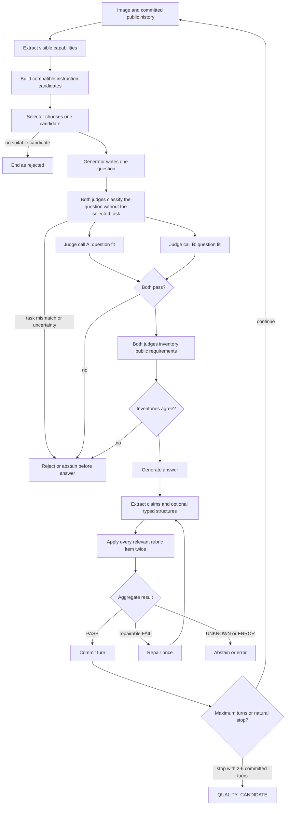

# Generate and evaluate dialogue

The decomposed evaluator, planned-length requirement, and historical examples on this page describe `evaluation.mode: detailed`. The current default is `holistic`: two whole-turn reviews with optional retention of accepted prefixes of at least two turns. See the [current workflow](../../README.md).

The visible output of one turn is only a question and an answer. Reaching that pair takes several checks, and their order prevents later information from changing an earlier decision.

[Previous: prepare images](data-and-ingestion.md) · [Back to contents](README.md) · [Next: select and export](selection-and-export.md)

## 1. Start from healthy model servers

Long GPU processes must run in `tmux`. Inspect `nvidia-smi`, choose an idle device explicitly, start the larger server first, and wait for `/v1/models` before starting the smaller selector. The following files belong to the temporary one-GPU pilot, which substitutes Qwen3.5-9B for the standard Qwen3.8-27B-FP8 and Gemma 4 31B pair:

```text
runtime/vllm/generator-qwen35-9b.yaml  -> port 8002
runtime/vllm/router-default.yaml     -> port 8000
```

Check both through Pixelogue:

```sh
uv run --locked pixelogue doctor \
  --config configs/pilot.yaml \
  --check-servers
```

A healthy model list proves that the server is reachable. Before a long run, send one real image through the same structured-output schemas as the full pipeline. A server can answer `/v1/models` and still reject a JSON Schema used for guided decoding.

## 2. Start synthesis

```sh
uv run --locked pixelogue synthesize \
  --config configs/pilot.yaml \
  --images artifacts/prepared-open-images/images.jsonl \
  --artifact-root artifacts/prepared-open-images \
  --run-id open-images-pilot-001 \
  --output artifacts/open-images-pilot-001/conversations.jsonl
```

The standard and regular pilot profiles allow four images in flight through `runtime.max_concurrent_images`; the one-GPU paired pilot allows two. This gives vLLM independent requests to combine with continuous batching. `--workers` may reduce the value for a measured run but cannot exceed the configured bound. Use a separate configuration with an explicit bound for a higher-concurrency comparison. Pixelogue preserves the scheduled input order in `conversations.jsonl`, while every turn within one conversation remains sequential because it depends on committed public history.

For a balanced 1/2/4-worker study, save the six runs and frozen `experiment-plan.json`/`progress.json` together, then run `python validation/compare_concurrency_runs.py EXPERIMENT_DIR`. The JSON, CSV, and Markdown summaries validate image order, model assignments, config hashes, and turn counts. Automatic quality candidates per synthesis GPU hour are descriptive; human-approved output per allocated GPU hour remains unmeasured until independent ballots are resolved.

For a focused diagnostic run, repeat `--source-id ID` to select exact sources from the already rights-checked prepared manifest. The full manifest must still match `images.jsonl`; unknown or repeated IDs fail before any model call. Use a new run ID for each selected set.

After a run, write private per-image and per-turn diagnostics from the saved request records:

```sh
uv run --locked pixelogue run-diagnostics \
  --config configs/pilot.yaml \
  --run-id open-images-pilot-001 \
  --conversations artifacts/open-images-pilot-001/conversations.jsonl \
  --output-stem artifacts/open-images-pilot-001/diagnostics
```

This writes JSON, CSV, and Markdown. The report counts attempted turns, committed turns, and completed quality-candidate conversations separately. A turn is attempted when it has a saved turn, model call, or explicit stop record; older runs without those records may undercount attempts. The report also includes reached stages, malformed calls, retries, candidate-local binding rejections, private stop reasons, elapsed model-call time, and recorded tokens. New runs save each structured-output contract failure and its next correction prompt as a private artifact. Failed calls may lack token usage, and cost remains unknown without a recorded price schedule. Older runs may lack explicit stop or per-attempt records.
Completed quality candidates have no stop stage or stop reason; earlier corrected attempts remain visible in the attempt records.

Use a new run ID after changing configuration, code, prompts, catalogs, or schemas. The configuration hash includes package Python and resource files, selected lock files, Schemas, pinned model and processor settings, and the configured input manifest. `synthesize` also binds the prepared rights-checked manifest and selected image records to its run contract; a conflicting resume is rejected.

Before processing the first image, Pixelogue makes two exact schedules:

- a target-language schedule from the configured weights;
- a generator-role schedule from `generation_allocation`.

The configured count is exact over the batch. Random seeds only determine the stable order. Once a generator role is assigned, that role handles question generation, answer generation, and the one allowed repair for the complete conversation.

After each image, the command atomically rewrites `conversations.jsonl` and its summary. A later image can fail without erasing completed records.

## 3. Build one turn


```mermaid
flowchart TD
    A[Image and committed public history] --> B[Extract visible capabilities]
    B --> C[Build compatible instruction candidates]
    C --> D[Selector chooses one candidate]
    D -->|no suitable candidate| X[End as rejected]
    D --> E[Generator writes one question]
    E --> T[Both judges classify the question without the selected task]
    T -->|task mismatch or uncertainty| Y[Reject or abstain before answer]
    T --> F[Judge call A: question fit]
    T --> G[Judge call B: question fit]
    F --> H{Both pass?}
    G --> H
    H -->|no| Y[Reject or abstain before answer]
    H --> I[Both judges inventory public requirements]
    I --> J{Inventories agree?}
    J -->|no| Y
    J --> K[Generate answer]
    K --> L[Extract claims and optional typed structures]
    L --> M[Apply every relevant rubric item twice]
    M --> N{Aggregate result}
    N -->|PASS| O[Commit turn]
    N -->|repairable FAIL| P[Repair once]
    P --> L
    N -->|UNKNOWN or ERROR| Q[Abstain or error]
    O --> R{Maximum turns or natural stop?}
    R -->|continue| A
    R -->|stop with 2-6 committed turns| S[QUALITY_CANDIDATE]
```

### Step 1: extract visible capabilities

The generation model receives the image and a fixed capability vocabulary. It may report facts such as `readable_text`, `countable_entities`, or `spatial_relation`, along with a bounded visible scope. These are provisional observations. They do not become public dialogue and do not prove that a specific question is correct.

The model returns observations as an object keyed by capability. The controller rejects unknown and repeated capability keys. Definitions are intentionally strict: for example, aligned repeated objects do not establish an explicit `visible_mapping`.

If a scope gives an `object_label` without a MET `visible_entity` in that same scope, the bounded retry identifies the scope by number and asks the model to support the label with visible evidence or clear it. The rejected response remains private; the controller does not supply a missing MET observation.

For controlled comparisons, `tasks.attribute_recheck_enabled: true` permits one extra answer-blind image call when a scope has a visible entity and interaction but no `visible_attribute` observation. The call checks that scope only. Its region and view must match the original evidence; `UNKNOWN` does not make a task eligible. The default is `false`. The added call costs time and must be evaluated against an otherwise identical run before enabling it routinely.

### Step 2: build instruction candidates

The controller matches reported capabilities to the checked-in task catalog. Each candidate has a stable ID, task ID, family, profile, visible scope, summary, and required capabilities.

A candidate is an operation, not a finished question. Each model binding has a required `target` object. `visible_count` might later become “How many red squares are there?”, while `attribute_lookup` might become “What colour is the left square?”

For image-sourced targets, the controller carries the target evidence region into selection, question writing, and question review. This location cue helps keep a later question on its bound object when several objects share one scope. It does not reveal an answer label or permit a question about a nearby object.
For object identification, a single-object scope may carry a conservative `object_label` backed by a MET `visible_entity` observation. The controller lists the valid `typed_object_refs` for that candidate in the blind binding input. The binding can cite one as `target.value: "ref:<evidence_id>"`; the controller resolves the private label without asking the model to repeat its wording. An empty list means that no typed object reference is available. A missing label, unknown ID, nonlocal observation, or observation without MET is rejected. Free-text targets still require the cited observation to name the category. A broad region containing other objects is insufficient.
The controller validates every binding independently after checking all candidate IDs for unknown or duplicate values. A malformed binding is recorded privately and excluded; another fully valid binding in the same response remains selectable. If every proposed binding is malformed, the bounded model retry still applies and exhaustion abstains. Missing or UNKNOWN checks never become MET.
An instruction-origin target that cites image evidence fails source validation for that candidate alone; valid siblings still pass through the normal admission checks.
On later turns, one slot can carry a previously used `attribute_lookup` task so a different visible property remains eligible. The controller removes an attribute binding when its scope, target, and public property repeat a committed request (including `color`/`colour` spelling). It also recognizes a generic color fact stated directly in an earlier committed identification question such as “What is this red fruit?” when that turn's answer names the same target. A color on a nearby object and a part-specific property remain eligible. Broader semantic overlap still requires question review and human audit.

### Step 3: select one instruction

The active selector receives only:

- the image;
- the target language;
- the exact committed public history;
- the current candidate set.

It does not receive an answer, a future turn, dataset labels, fixture keys, or another model's decision. It returns one candidate ID or `null` with a short internal reason. An unknown ID is rejected. `null` ends the current plan; Pixelogue does not switch to the alternative selector.

### Step 4: write and check the question

The assigned generation role turns the selected operation into one public question. First, both evaluator roles classify the question against all 72 task definitions without receiving the selected task or an answer. A different agreed task rejects the question; uncertainty or disagreement abstains. Both roles then check three points before any answer exists:

1. the question has a visible or public-history anchor;
2. it performs the selected operation coherently;
3. it is useful and does not repeat an answered request.

Each role returns `MET`, `NOT_MET`, or `UNKNOWN`. A clear negative rejects the turn. Missing evidence or disagreement causes abstention. An answer is never generated for a question that did not pass.

Before those model calls, the controller checks exact normalized question repeats, substantial echoes of private model instructions, and unresolved internal references such as `scope_0` or “selected region”. Invalid drafts get a bounded correction attempt; unresolved drafts are rejected. The rejected text and reason are stored for diagnosis. Paraphrases still go to both image-aware evaluators. Re-rating stored turns applies the same internal-reference check. After answer generation, the controller rejects a close paraphrase that reproduces the same substantial answer as an earlier turn, before spending answer-review calls.

### Step 5: freeze public requirements before the answer

Both evaluator calls independently list every explicit requirement in public user text. Each item stores its kind, lifetime, source message ID, and exact character offsets. The controller verifies that the cited span exists unchanged.

This matters because a fluent answer can make a forgotten requirement less noticeable. Freezing the list first prevents evaluators from weakening the request after seeing the answer. The two lists must agree before generation continues.

A normal question applies to the current turn. A requirement persists only when the user explicitly extends it to later turns, as in “From now on, answer in one sentence.”

### Step 6: generate the answer

The same conversation generator sees the image, exact committed history, current question, target language, and agreed active requirements. It returns public text or an internal unsupported reason. Candidate IDs, evaluator names, and private reasons are forbidden in public text.

### Step 7: decompose and evaluate the answer

Both evaluator roles extract every factual claim as an exact span in the answer. Pixelogue derives claim IDs from validated content rather than asking the model to invent them. If a quoted phrase occurs exactly once but its offsets are wrong, the controller can correct them deterministically; ambiguous spans remain invalid.

The controller then instantiates every applicable rubric item. The checks cover question and answer clarity, relevance, visible grounding, claim correctness and coverage, uncertainty, safety, target language, history use, and public naturalness.

Being a later turn activates consistency and turn-progress checks. It does not by itself activate `H_BINDING` or `H_WITNESS`. `H_BINDING` requires an actual resolved reference to prior public state; the current ledger supplies it for persistent requirements from an earlier user message and passes that requirement to the evaluator. `H_WITNESS` requires the coordinator to designate and provide a history-dependency witness. The current synthesis path does not yet produce that witness artifact, so this item remains inapplicable instead of being guessed from the turn number. This distinction prevents an unrelated second question about the same image from being judged as though it claimed a strong dependency on the first answer.

Natural-language-only criteria are instantiated only when the answer contains a Unicode letter. A numeric answer such as `42` still receives the always-applicable factual, relevance, safety, and public-usability checks, but it is not sent through prose clarity, prose redundancy, or answer-language gates. Units such as `kg` contain letters and therefore keep those language checks enabled.

Two additional paths avoid relying on a prose verdict alone:

- For grounded arithmetic, both roles extract typed operands and units. The controller recomputes an agreed allowlisted operation without binary floating-point arithmetic.
- For exhaustive count or set questions, both roles bind expected and reported members. The controller compares the complete sets and preserves duplicates for diagnosis.

Evaluator calls are blind: neither receives the other verdict or the generator-role name. The standard profile uses Qwen3.8-27B-FP8 for role A and Gemma 4 31B for role B. In the temporary one-GPU pilot, both roles use the same Qwen3.5-9B endpoint. Pixelogue bypasses the result cache for the second logical call so two requests are made, while still reporting the lack of model-lineage diversity.

### Step 8: repair once or commit

If the aggregate is a clear, repairable `FAIL`, the same generation role may replace the answer once. All claim extraction, typed checks, and rubric evaluation then run again. A repaired answer never inherits the old pass results.

Only a `PASS` turn is committed. Its question and answer become immutable public history for the next turn. If generation stops before two committed turns, the conversation cannot become a `QUALITY_CANDIDATE`.

## 4. Consensus does not average uncertainty away

At a required gate, two `MET` verdicts pass. Any `NOT_MET` gives a clear failure. `UNKNOWN` remains unknown, and an execution error remains an error. Pixelogue does not turn a weak average into a pass.

The final conversation status records where the image ended:

- `QUALITY_CANDIDATE`: two to six committed turns and no terminal failed turn;
- `REJECTED`: a definite quality failure or unsuitable plan;
- `ABSTAINED`: insufficient evidence or evaluator disagreement;
- `ERROR`: model transport, structured output, storage, or another execution failure.

## 5. What the run store preserves

For each model call, the local store writes the model lock, stage, request hash, request artifact, response artifact, token counts, and status. Calls that fail schema validation are recorded as `INVALID` with their raw response artifact so the failure can be inspected.

The SQLite database is the index. Request and response bodies live in content-addressed paths such as:

```text
/var/tmp/pixelogue/<run-id>/
├── run.sqlite3
├── run.sqlite3-wal
├── run.sqlite3-shm
└── artifacts/
    ├── requests/08/<sha256>
    ├── responses/24/<sha256>
    ├── public-text-rejections/6c/<sha256>
    └── turns/ab/<sha256>
```

Do not publish this directory as training data. It contains internal prompts, evaluation reasons, and operational information.

## 6. Watch a long run without guessing

Check more than process existence:

```sh
tmux list-windows -t pixelogue-qwen35-pilot \
  -F '#{window_index}:#{window_name} pane_dead=#{pane_dead}'
wc -l artifacts/open-images-pilot-001/conversations.jsonl
cat artifacts/open-images-pilot-001/conversations.summary.json
nvidia-smi
```

An output row may be `ERROR`, so a growing line count is only one signal. Confirm that model calls complete, errors do not repeat across every image, committed turns appear, and reserved output tokens return to zero when the run ends.

The run database contains per-request duration and token counts for new runs. Generate a stage and model summary with:

```sh
uv run --locked pixelogue profile \
  --database /var/tmp/pixelogue/open-images-pilot-001/run.sqlite3 \
  --output artifacts/open-images-pilot-001/inference-profile.json
```


### Requirement extraction protocol update

Requirement inventories use the strict boolean `extraction_complete`, not the old
`coverage` verdict. It means every explicit user requirement was extracted; it never
scores an answer. No answer or image is supplied at this stage. Incomplete extraction
abstains, even if both models report incomplete; it is not a failed answer.
One content requirement represents one requested operation including its scope.
Explicit format, language and style clauses are separate; target_language does not
create a public language requirement. Quotes exclude outer whitespace and clause-ending
punctuation. Exact source validation and agreement between independent inventories remain
mandatory. Unknown fields and legacy coverage responses are rejected, not promoted.
This changes the prompt and response schema: use a new run ID and output directory.
An eight-question check on the standard model pair agreed in all eight cases, including
three historical failures. This does not measure full-dialogue acceptance or resolve all
structured-output failures in other stages.

Text-only `R_REQUIREMENT` checks whether an answer addresses the requested operation, target,
scope and explicit response constraints. It must not judge visual truth or abstain merely because
no image is supplied. Image-aware factual and exhaustive-set criteria remain required independently.
Requirement extraction retains introductory scope phrases with their content request. Evidence with
a different image ID is regenerated within the existing structured-output attempt limit; the ID is
never silently rewritten. Schema retries enumerate required top-level fields without quoting the
invalid response. Use a new run ID and output directory when validating these prompt changes.

Extraction validation now happens before downstream grading. Claim models select boundaries in a controller-supplied numbered token table instead of copying
text, character offsets or source IDs. The controller reconstructs the exact original substring
and attaches the single answer ID. Requirement extraction uses short local
message references, mapped back to real public IDs only after source validation. Invalid references
or altered quotes trigger bounded retries, never fuzzy acceptance. Courtesy prefixes (`Please`,
`Can you`) and outer sentence punctuation are normalized only after validating the original span;
negation, scope restrictions and different operations still require agreement.

`C_COVERAGE` receives the validated claim union as `candidate_claim_inventory` and compares it with
the answer text, without image input or other judges' verdicts. Other criteria cannot receive this
field. Short direct answers need no extra sentence framing unless explicitly requested.

Set extraction requires every field, including empty arrays. Count mode compares independently
extracted expected and reported counts per question category rather than requiring answer member
names. Member mode ignores list order while preserving duplicates and exact member agreement;
arbitrary synonym matching is not allowed. Unreadable scope is not a zero count. Set checks do not
replace image-aware factual or completeness judgments. `rating-decisions` private artifacts retain
full votes and the controller's set/coverage result so an overridden verdict can be diagnosed.
These protocol changes require a new run ID; do not resume an old run with the new contracts.

Retryable HTTP 429/5xx responses retain up to 4096 characters of response text in private
`transport-errors` artifacts with model, attempt and request hash, without request headers.
Claim extraction has a 2048-token response budget; answer generation is instructed to avoid
unrequested long enumerations. Token limits and bounded retries still apply.

Count categories need not be literal question substrings: open-ended color grouping and per-ring
counts may introduce visible labels such as `white` or `innermost ring`. Explicit category wording
is reused when available; grouping must still follow the request, and independent inventories and
image-aware checks must agree. Token-boundary extraction now sends answer-specific JSON Schema
maximums (`start_token < token_count`, `end_token <= token_count`); an empty token table permits
only an empty claim list. Post-generation validation still enforces ordered, nonempty spans.
