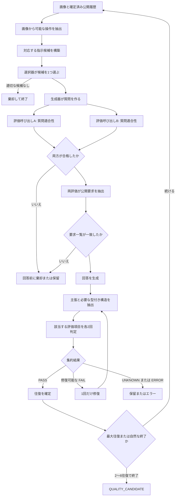

# 対話を生成して評価する

1往復で読者に見えるのは、質問と回答だけです。ただし、その組を確定するまでには複数の検査があり、順序にも意味があります。後から得た情報で、先に行った判断を書き換えないためです。

[前へ：画像を準備する](data-and-ingestion_ja.md) · [目次へ戻る](README_ja.md) · [次へ：選抜して出力する](selection-and-export_ja.md)

## 1. モデルサーバーが正常であることを確認する

時間のかかるGPU処理は `tmux` 内で実行します。`nvidia-smi` で空いているGPUを調べて明示的に選び、大きいモデルから起動します。`/v1/models` が応答するまで待ってから、小さい選択器を起動します。次のファイルは、本来のQwen3.8-27BとGemma 4 31Bの代わりにQwen3.5-9Bを使う、一時的な1 GPU用pilotの設定です。

```text
runtime/vllm/generator-qwen35-9b.yaml  -> port 8002
runtime/vllm/selector-default.yaml     -> port 8000
```

Pixelogue側から両方を確認します。

```sh
uv run --locked pixelogue doctor \
  --config configs/pilot.yaml \
  --check-servers
```

モデル一覧が取得できれば、サーバーへ接続できることは分かります。ただし、本番で使うJSON Schemaを受理できるとは限りません。長時間処理の前に、同じ構造化出力を使って1画像だけ処理してください。

## 2. 生成を開始する

```sh
uv run --locked pixelogue synthesize \
  --config configs/pilot.yaml \
  --images artifacts/prepared-open-images/images.jsonl \
  --artifact-root artifacts/prepared-open-images \
  --run-id open-images-pilot-001 \
  --output artifacts/open-images-pilot-001/conversations.jsonl
```

Gitに含まれる設定では、`runtime.max_concurrent_images` により、最大4画像を同時に処理します。独立した要求をvLLMへ重ねて送り、continuous batchingが働くようにするためです。測定時は `--workers` で一時的に上書きできます。`conversations.jsonl` は計画した入力順で保存します。1つの対話内の往復は確定済みの公開履歴に依存するため、順番を変えません。

設定、コード、プロンプト、カタログ、Schemaを変更した場合は、新しいrun IDを使います。run storeは設定のハッシュを記録しますが、現時点ではソースやプロンプトのあらゆる変更をrun IDへ結び付けてはいません。

最初の画像を処理する前に、Pixelogueは2つの割り当て表を作ります。

- 設定した比率に基づく生成言語の割り当て
- `generation_allocation` に基づく生成器の役割の割り当て

バッチ全体で指定件数に正確に一致し、seedは再現可能な順番を決めます。生成器の役割が決まると、その対話の質問、回答、1回だけ許される回答修復は、同じ役割が担当します。

1画像を終えるたびに、`conversations.jsonl` とsummaryをatomicに書き換えます。後の画像で失敗しても、それまでに確定した結果は失われません。

## 3. 1往復を組み立てる



### 手順1：画像から可能な操作を抽出する

生成モデルには、画像と固定したcapability一覧を渡します。`readable_text`、`countable_entities`、`spatial_relation` など、画像から実行できそうな操作と、対象範囲を返します。これは暫定的な観察結果であり、公開対話には入りません。また、具体的な質問が正しいことを保証する結果でもありません。

コントローラーは未知の項目と重複を拒否します。定義にも境界があります。例えば、同じ物が一列に並んでいるだけでは、項目同士の明示的な対応を表す `visible_mapping` にはなりません。

### 手順2：指示候補を作る

コントローラーが、抽出したcapabilityとGitに含まれるタスクカタログを照合します。各候補には、安定したcandidate ID、task ID、family、プロファイル、画像内の対象範囲、短い説明、必要なcapabilityが入ります。

候補は完成した質問ではなく、実行する操作です。`visible_count` なら「赤い四角はいくつありますか」、`attribute_lookup` なら「左の四角は何色ですか」のような質問へ具体化できます。

### 手順3：指示を1つ選ぶ

有効な選択器へ渡す情報は、次のものだけです。

- 画像
- 生成言語
- それまでに確定した正確な公開履歴
- 現在の指示候補

回答、未来の往復、データセットのラベル、fixtureの正解、他モデルの判定は渡しません。選択器は1つのcandidate ID、または短い内部理由と `null` を返します。未知のIDは拒否します。`null` なら現在の計画を終了し、別の選択器へ自動的に切り替えません。

### 手順4：質問を作り、回答前に検査する

割り当て済みの生成器が、選んだ操作を1つの公開質問へ変換します。その後、評価器AとBが、まだ回答がない状態で次の3点を確認します。

1. 画像または公開履歴の中に、質問の対象がある。
2. 選んだ操作と質問内容が一致している。
3. 既に回答済みの内容を繰り返さず、この対話で尋ねる意味がある。

各評価器は `MET`、`NOT_MET`、`UNKNOWN` のいずれかを返します。明確な不合格なら棄却し、根拠不足や不一致なら保留します。このgateを通らない質問に対して、回答を生成することはありません。

### 手順5：回答を見る前に公開要求を固定する

2つの評価呼び出しが、公開されたユーザー文中の明示的な要求をそれぞれ抽出します。各要求には種類、有効期間、元のmessage ID、正確な文字位置を記録します。コントローラーは引用箇所が元の文中にそのまま存在するかを確認します。

流暢な回答を見ると、満たしていない条件を見落としやすくなることがあります。回答前に一覧を固定すれば、評価時に要求を弱めることはできません。2つの一覧が一致した場合だけ次へ進みます。

通常の質問は現在の往復だけで有効です。「今後は1文で答えてください」のように、将来にも適用することを明示した要求だけをpersistentとして扱います。

### 手順6：回答を生成する

同じ対話を担当する生成器が、画像、確定済み履歴、現在の質問、生成言語、合意した公開要求を読み、公開回答を返します。回答できない場合は、公開文を作らず内部理由を返せます。candidate ID、評価器名、内部の判定理由を公開回答へ含めてはいけません。

### 手順7：回答を分解して評価する

評価器AとBが、回答内の事実主張を正確な文字位置とともに抽出します。claim IDはモデルに作らせず、検証済みの内容からPixelogueが決めます。引用文が回答内に1回だけ現れ、位置だけがずれている場合は決定的に補正できます。複数箇所にある引用は推測しません。

続いて、該当する評価項目をすべて具体化します。質問と回答の明瞭さ、関連性、画像による裏付け、主張の正しさと網羅性、不確実性、安全性、言語、履歴の利用、公開文としての自然さを検査します。

文章による判定だけに頼らない経路もあります。

- 画像に基づく計算では、2つの評価器が型付きの値と単位を抽出します。合意した演算をコントローラーがbinary浮動小数点数を使わず再計算します。
- 数や集合を漏れなく答える質問では、画像内の要素と回答された要素を安定した最小単位へ結び付け、コントローラーが集合全体を照合します。重複も調査用に残します。

評価呼び出しは、相手の判定と生成器の役割を知りません。standardプロファイルでは、評価器AにQwen3.8-27B、評価器BにGemma 4 31Bを使います。一時的な1 GPU用pilotでは、両方が同じQwen3.5-9Bエンドポイントを使います。2回目をキャッシュから返さず実際に別の要求として送りますが、異なるモデル系列による評価ではないことは結果へ明記します。

### 手順8：1回だけ修復するか、往復を確定する

集約結果が明確かつ修復可能な `FAIL` なら、同じ生成器が回答を1回だけ置き換えられます。その後、主張抽出、型付き検査、評価項目をすべてやり直します。修復前の合格判定を引き継ぐことはありません。

`PASS` した往復だけを確定します。質問と回答は変更不能な公開履歴となり、次の往復で使われます。確定済みの往復が2つに達する前に終了した対話は、`QUALITY_CANDIDATE` にはなりません。

## 4. 根拠不足を平均で合格にしない

必須gateでは、2つの `MET` が揃った場合だけ通過します。どちらかが `NOT_MET` なら明確な不合格です。`UNKNOWN` は判断不能のまま、実行時エラーはエラーのまま残します。弱い平均値を合格へ丸めません。

対話全体の状態は、終了した地点を表します。

- `QUALITY_CANDIDATE`：2〜6往復が確定し、途中に失敗した往復がない。
- `REJECTED`：明確な品質違反または不適切な計画が見つかった。
- `ABSTAINED`：根拠または評価器間の合意が不足した。
- `ERROR`：モデル通信、構造化出力、保存などの実行境界で失敗した。

## 5. run storeに残るもの

モデル呼び出しごとに、モデルの固定情報、stage、要求ハッシュ、要求と応答のアーティファクト、トークン数、状態を保存します。Schema検証に失敗した応答も `INVALID` として、生の応答アーティファクトを残します。

SQLiteは索引の役割を持ち、要求と応答の本体は内容ハッシュに基づくパスへ保存します。

```text
/var/tmp/pixelogue/<run-id>/
├── run.sqlite3
├── run.sqlite3-wal
├── run.sqlite3-shm
└── artifacts/
    ├── requests/08/<sha256>
    ├── responses/24/<sha256>
    └── turns/ab/<sha256>
```

このディレクトリには内部プロンプト、評価理由、運用情報が含まれます。学習データとして公開しません。

## 6. 長時間実行を複数の情報で監視する

プロセスの存在だけで判断せず、次を組み合わせます。

```sh
tmux list-windows -t pixelogue-qwen35-pilot \
  -F '#{window_index}:#{window_name} pane_dead=#{pane_dead}'
wc -l artifacts/open-images-pilot-001/conversations.jsonl
cat artifacts/open-images-pilot-001/conversations.summary.json
nvidia-smi
```

出力行が `ERROR` の場合もあるため、行数の増加だけでは完了を意味しません。model callが正常に完了しているか、全画像で同じエラーが続いていないか、確定済みの往復があるか、終了時に予約中トークンが0へ戻ったかも確認します。

新しいrunでは、要求ごとの所要時間とトークン数をrun DBへ記録します。stage別、モデル別の集計は次のコマンドで作成できます。

```sh
uv run --locked pixelogue profile \
  --database /var/tmp/pixelogue/open-images-pilot-001/run.sqlite3 \
  --output artifacts/open-images-pilot-001/inference-profile.json
```
