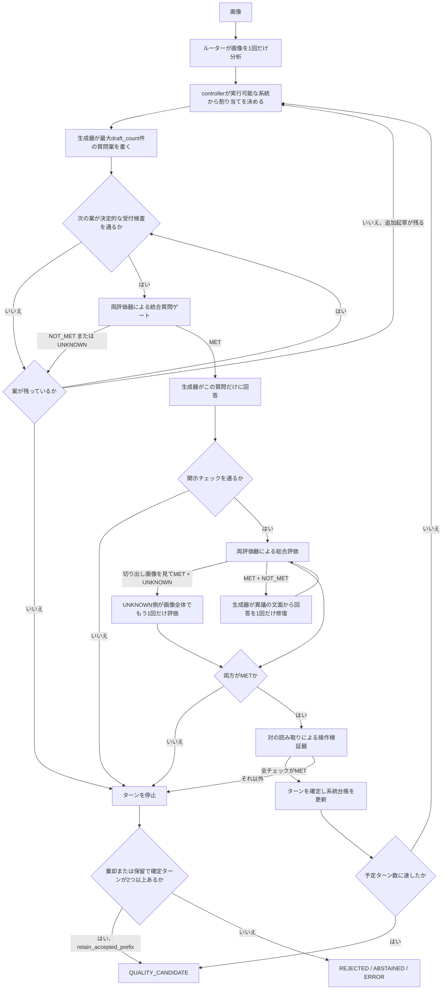

# 対話を生成して評価する

1往復で読者に見えるのは、質問と回答だけです。ただし、その組を確定するまでには複数の検査があり、順序にも意味があります。質問が検査を通るまで回答は作らず、どちらの評価器も相手の判定を見ることはありません。

[前へ：画像を準備する](data-and-ingestion_ja.md) · [目次へ戻る](README_ja.md) · [次へ：選抜して出力する](selection-and-export_ja.md)

## 1. モデルサーバーが正常であることを確認する

時間のかかるGPU処理は `tmux` 内で実行します。`nvidia-smi` で空いているGPUを調べて明示的に選び、大きいモデルから起動します。`/v1/models` が応答するまで待ってから、小さいルーターを起動します。次のファイルは、本来のQwen3.8-27B-FP8とGemma 4 31Bの代わりにQwen3.5-9Bを使う、一時的な1 GPU用pilotの設定です。

```text
runtime/vllm/generator-qwen35-9b.yaml  -> port 8002
runtime/vllm/router-default.yaml       -> port 8000
```

評価器には画像全体と切り出し画像を同時に渡すことがあるため、生成器用のサーバー設定はすべて1回の要求で画像を2枚まで受け付けます。ルーター用のサーバーは1枚です。

Pixelogue側から両方を確認します。

```sh
uv run --locked pixelogue doctor \
  --config configs/pilot.yaml \
  --check-servers
```

モデル一覧が取得できれば、サーバーへ接続できることは分かります。ただし、本番で使うJSON Schemaを受理できるとは限りません。長時間処理の前に、同じ構造化出力を使って1画像だけ処理してください。

## 2. 生成を開始する

```sh
uv run --locked pixelogue synthesize \
  --config configs/pilot.yaml \
  --images artifacts/prepared-open-images/images.jsonl \
  --artifact-root artifacts/prepared-open-images \
  --run-id open-images-pilot-001 \
  --output artifacts/open-images-pilot-001/conversations.jsonl
```

standard、通常pilot、1 GPUのモデル対pilotは、`runtime.max_concurrent_images` により最大4画像を同時に処理します。1 GPUのモデル対pilotは、完了した画像の枠にすぐ次の画像を入れます（`runtime.refill_completed_images: true`）。標準のモデル対とrouterを1 GPUで動かし、この補充を使った計測では、4画像は2画像に比べて1画像あたりの壁時計時間が約0.71倍で、収量はほぼ同じでした。8画像の追加短縮は約7%にとどまり、各画像の待ち時間は約2倍になりました。独立した要求をvLLMへ重ねて送り、continuous batchingが働くようにするためです。測定時の `--workers` は設定上限以下に限り、より高い並列数の比較には上限を明示した別設定を使います。`conversations.jsonl` は計画した入力順で保存します。1つの対話内の往復は確定済みの公開履歴に依存するため、順番を変えません。1往復の中では、2つの評価器への呼び出しと、各検証器の2回の読み取りを並行して送ります。データベースへの書き込みは直列のままです。

並列数1/2/4の比較では、6回のrunと固定済みの `experiment-plan.json`・`progress.json` を同じディレクトリに保存し、`python validation/compare_concurrency_runs.py EXPERIMENT_DIR` を実行します。JSON・CSV・Markdownの集計で画像順、モデル割当、設定hash、ターン数を検査します。自動品質候補数／合成時GPU時間は記述的な値であり、人手承認済み出力／総割当GPU時間は独立評価票が確定するまで未測定です。

対象を絞る診断runでは `--source-id ID` を繰り返し指定し、権利確認済みの準備済みmanifestから正確な画像を選択できます。元の `images.jsonl` とmanifest全体の一致は引き続き検査します。未知・重複したIDはモデル呼び出し前に拒否し、選択集合ごとに新しいrun IDを使います。

実行後は保存済み要求から、画像・ターン単位の非公開診断レポートを作成できます。

```sh
uv run --locked pixelogue run-diagnostics \
  --config configs/pilot.yaml \
  --run-id open-images-pilot-001 \
  --conversations artifacts/open-images-pilot-001/conversations.jsonl \
  --output-stem artifacts/open-images-pilot-001/diagnostics
```

JSON・CSV・Markdownに、試行したターン、確定ターン、完成した品質候補の会話を分けて集計します。保存済みターン、モデル呼び出し、明示的な停止記録のいずれかがあるターンを試行として数えます。古いrunでこれらの記録がない場合、試行数は過少になる可能性があります。到達段階、形式不備、再試行、非公開の停止記録、モデル呼び出し時間、記録されたトークン数も出力します。構造化出力の契約違反と次の修正指示は、試行ごとに非公開の `structured-output-failures` へ保存します。失敗した呼び出しのトークン数は欠測になり得ます。価格表を記録していない場合、費用は不明として扱います。binding棄却の欄に値が入るのは、廃止したscopedプランナーで作ったrunだけです。
完了した品質候補には停止段階・停止理由を付けません。途中で修正した試行は、試行記録に残します。

設定、コード、プロンプト、カタログ、Schemaを変更した場合は、新しいrun IDを使います。設定ハッシュにはアプリのPython・resourceファイル、対象のlock、Schema、固定したモデル・processor設定、設定済み入力manifestを含みます。`synthesize`では権利確認済みmanifestと選択画像の記録もrun契約に結び付け、異なる内容での再開を拒否します。

最初の画像を処理する前に、Pixelogueは2つの割り当て表を作ります。

- 設定した比率に基づく生成言語の割り当て
- `generation_allocation` に基づく生成器の役割の割り当て

バッチ全体で指定件数に正確に一致し、seedは再現可能な順番を決めます。生成器の役割が決まると、その対話の質問案、回答、1回だけ許される回答修復は、同じ役割が担当します。評価はどちらの生成器が書いた往復でも、両方の生成モデルが行います。

完了した対話は入力順に `conversations.jsonl` へ1行ずつ追記し、その都度flushします。summaryは最初の1件、100件ごと、終了時に更新し、終了時には `conversations.operations.json` も書きます。後の画像で失敗しても、それまでに保存した行は失われません。

## 3. 1つの対話を組み立てる

各画像の予定ターン数は2〜6で、画像IDとseedから決まります（2・3・4・5・6ターンの基準の重みは4/4/1/1/1）。ルーターが画像を1回だけ分析し、その後は各ターンが同じ経路を通ります。予定ターン数に達するか、確定できないターンが出た時点でループを終えます。


```mermaid
flowchart TD
    A[画像] --> B[ルーターが画像を1回だけ分析]
    B --> C[controllerが実行可能な系統から割り当てを決める]
    C --> D[生成器が最大draft_count件の質問案を書く]
    D --> E{次の案が決定的な受付検査を通るか}
    E -->|いいえ| F{案が残っているか}
    E -->|はい| G[両評価器による統合質問ゲート]
    G -->|NOT_MET または UNKNOWN| F
    F -->|はい| E
    F -->|いいえ、追加起草が残る| C
    F -->|いいえ| X[ターンを停止]
    G -->|MET| H[生成器がこの質問だけに回答]
    H --> I{開示チェックを通るか}
    I -->|いいえ| X
    I -->|はい| J[両評価器による総合評価]
    J -->|切り出し画像を見てMET + UNKNOWN| K[UNKNOWN側が画像全体でもう1回だけ評価]
    J -->|MET + NOT_MET| M[生成器が異議の文面から回答を1回だけ修復]
    M --> J
    K --> L
    J --> L{両方がMETか}
    L -->|いいえ| X
    L -->|はい| N[対の読み取りによる操作検証器]
    N -->|全チェックがMET| O[ターンを確定し系統台帳を更新]
    N -->|それ以外| X
    O --> P{予定ターン数に達したか}
    P -->|いいえ| C
    P -->|はい| Q[QUALITY_CANDIDATE]
    X --> R{棄却または保留で確定ターンが2つ以上あるか}
    R -->|はい、retain_accepted_prefix| Q
    R -->|いいえ| S[REJECTED / ABSTAINED / ERROR]
```

### 手順1：画像を1回だけ分析する

ルーター（`models.router`、`Qwen/Qwen3.5-2B` に固定）には、画像と、実行可能な操作を持つ各タスク系統の説明（系統ID、名称、操作名）を渡します。ルーターは `image_kind`、`readable_text`、`supported_families` と短い理由を返します。デコーダーは提示した系統IDしか出力できません。ルーターは質問、回答、公開履歴、データセットのラベルを見ず、公開文も書きません。

割り当てに使うのは `supported_families` と、`image_kind` が `screen` かどうかです。上限付きの再試行後も出力が不正な場合は、非公開の `image-profile-abstentions` に記録し、固定した汎用系統で割り当てを続けます。画像の処理は止まりません。

### 手順2：ターンの割り当てを決める

controllerは各ターンに、最大4操作の主系統と最大2操作の副系統を1つずつ提示します。

1. **実行可能な操作。** 起草に提示するのは、検証器が登録済みの標準65操作です。最初の `tasks.anchor_turns` ターン（既定2）では、2回の盲検評価・evidence binding・transcript alignmentだけで検証される軽い操作に限定します。これらのターンで最低2ターンに届くかが決まり、構造抽出型の検証器は棄権が多いためです。
2. **実行可能な系統。** 分析結果の系統のうち、実行可能な操作を持つものです。`screen_ui` は、`screen` と分析された画像でだけ残します。候補が残らない場合や分析結果がない場合は、`visual_description`、`text_reading`、`reference_spatial`、`set_logic`、`evidence_verification` を代わりに使います。
3. **主系統。** 会話内の確定ターンでまだ使っていない系統を先に検討します。その中から、目標比率（`tasks.family_targets`、既定は均等）とrun全体の確定ターンに占める比率との差が最も大きい系統を選びます。このrun全体の系統台帳は並行処理中の画像で共有し、確定のたびに更新します。副系統も同じ優先順で残りから選びます。
4. **操作。** 系統内では、会話内で未使用の操作を先にし、次にrun全体の確定ターン数を `tasks.task_weights` で割った値が小さい操作を優先します。重みの既定値は表・チャート・文書の構造復元が0.25、それ以外が1なので、構造全体の復元は提示される頻度が下がります。

同点の場合は、seed・画像・ターン・候補値のSHA-256順で決めます。各割り当ては `turn_route` テーブルに、会話、ターン番号、公開履歴hash、起草呼び出しの番号ごとに保存します。そのため、その間に他の画像が台帳を変えていても、再開したターンには同じ候補を提示します。

### 手順3：質問案を書く

会話を担当する生成器には、画像、確定済みの正確な公開履歴、生成言語、割り当て順の操作契約、系統の計画、確定済みターンの非公開fact key、`tasks.draft_count`（既定2）を渡します。生成器はその件数以内の案を返し、デコーダーは各 `task_id` を提示した操作に限定します。各案には次の項目があります。

- `task_id`：提示した操作の1つ
- `question`：公開するユーザーの質問
- `target`：対象を示す短い公開ロケーター。答えは含めません。
- `public_parameters`：操作に必須の公開パラメーターすべて
- `scope_region` と `target_region`：案が使った正規化領域と、その中の対象
- `fact_key`：「左の犬」「毛の色」のような非公開の対象と観点。値は含めません。

案が0件の応答も正当な棄権です。応答内のすべての案が操作契約に違反した場合は、`runtime.structured_output_max_attempts` の範囲で修正指示を付けて再試行します。それでも不正な応答は `draft-abstentions` に記録し、案がなかったものとして扱います。正常な応答は割り当てとともに `question-drafts` へ保存します。

### 手順4：案を決定的に受け付ける

案は順番に調べます。controllerはまず案を `origin: direct` の操作契約へ変換し、fact keyから非公開の `request_key` を作ります。`colour`／`color` のような表記差や冠詞の有無では、別の事実になりません。逐語転写・読み順・コード転写では、案の領域全体を文字の対象領域として結び付けます。

次のいずれかに当たる案は、評価器を呼ぶ前に棄却します。

- 提示していない操作を指定した、または公開パラメーターがカタログの契約に反する（未知・欠落した名前、未対応の値、2つの異なる選択肢がない場面分類）。`draft-rejections` に記録します。
- 正規化後の質問が、同じターンで質問ゲートに棄却済み
- 非公開のモデル指示の大部分を再現している
- `scope_0`、`evidence_…`、「selected region」のようなcontroller内部の参照を含む
- 正規化後に以前のユーザー質問と一致する
- fact keyが会話内の確定済みターンと一致する
- `visible_action_relation` の質問が、対象に何ができるかを尋ねている
- `text_transcription` の質問が、「上の」「隣の」のような相対位置で文字を指定している
- `scene_categorization` の質問が、列挙した選択肢をすべて示していない

2つ目以降の理由は、棄却した文とともに `public-text-rejections` へ保存します。棄却した案は非公開のままで、後の起草呼び出しにも渡しません。

### 手順5：両評価器で質問を審査する

両方の生成モデルが盲検の評価器として、それぞれ1回ずつ `question_gate` を並行して呼び出します。評価器が見るのは、画像、公開履歴、案の操作契約、72タスクすべての定義、質問です。この時点で回答はまだありません。各評価器は3つの判定と理由を返し、最後に質問が実際に求めている操作を独自のラベル（`realized_task_id`、該当なしはnull）として返します。

1. `local_anchor`：画像または確定済み履歴に実在するものを指している。対象領域がある場合は、その対象を指している。
2. `operation_coherent`：案の操作を、すべての公開パラメーターと実行条件を満たしたまま正確に実現している。
3. `useful_request`：回答済みの要求を繰り返さず、質問自体に答えを書いていない。

各評価器の3判定は、すべて `MET` なら `MET`、1つでも `NOT_MET` なら `NOT_MET` にまとめます。2つのラベルは `evaluation.question_gate_label_policy` に従って照合します。

| ラベルの結果 | `strict` | `same_contract`（既定） |
|---|---|---|
| 両方のラベルが案の操作 | `MET`（`exact`） | `MET`（`exact`） |
| 一方が案の操作、もう一方が検証契約の同一な別の操作 | `UNKNOWN`（`label_unresolved`） | `MET`（`same_contract`） |
| 両方が同じ隣接操作（検証契約が同一）で、案がその操作の必須公開パラメーターをすでに持つ | `NOT_MET`（`label_mismatch`） | `MET`。ターンのラベルを付け替える（`relabel`） |
| 両方が同じ別の操作 | `NOT_MET`（`label_mismatch`） | `NOT_MET`（`label_mismatch`） |
| それ以外の不一致、またはnull | `UNKNOWN`（`label_unresolved`） | `UNKNOWN`（`label_unresolved`） |

ラベルの結果が `MET` で、両評価器のまとめた判定も `MET` の場合だけ質問を通します。明確な棄却になるのは、両評価器が `NOT_MET` の場合か、ラベルが別の操作で一致した場合です。それ以外で通らなかったものは判断不能として扱います。どちらの場合も次の案を調べます。その呼び出しの案がどれも通らなければ、もう1回だけ起草を呼び出し（`tasks.extra_draft_calls_per_turn`、既定1）、最初の呼び出しで提示しなかった系統を優先して割り当てます。それも通らなければターンを停止します。最後のゲート判定が判断不能なら保留、それ以外は棄却です。両評価器の票を含む各判定は `question-gate-decisions` に保存します。

**評価器に渡す画像。** 物体同定、属性取得、文字転写、読み順、コード転写で、結び付けた領域が画像全体より小さい場合、controllerは対象領域（なければscope領域）を正確に切り出します。丸めによって領域を広げることはなく、元のviewと座標を `focus-views` に記録します。`evaluation.judge_views: full_and_crop`（既定）では、1枚目に画像全体、2枚目に切り出し画像を渡します。評価器は切り出し画像の中の対象を判定し、画像全体は文脈の確認だけに使います。`crop` では切り出し画像だけを渡します。その他の操作では常に画像全体を使います。完全な画素を1つも含まない切り出しは `focus-view-abstentions` に記録します。この場合、`full_and_crop` では画像全体を渡し、`crop` では判定を `UNKNOWN` とします。どちらの方式でも、そのターンは操作検証を通過できません。生成器には常に画像全体を渡します。

### 手順6：最初に通った質問に回答する

回答するのは、受付検査と質問ゲートを最初に通過した案だけです。同じ生成器が、画像、正確な履歴、質問、生成言語、期待する操作契約を読み、公開回答か、回答しない場合の内部理由を返します（`answer_generation`、上限は `tasks.answer_max_tokens`、既定1024）。生成器が回答しなかった場合、そのターンは棄却として停止します。1ターンで回答する質問は1つだけなので、失敗した回答を同じターン内でより易しい質問へ置き換えることはありません。

評価の前に、controllerは次の回答を棄却します。非公開の指示を再現した回答、言い換えた質問に以前と同じ長い回答を返したもの、そして質問に何も加えない回答です。最後の例は、質問に既に書かれている物体名や転写文、質問で既に述べた動作、公開された対象名を繰り返すだけのUI位置です。文と理由を `public-text-rejections` に保存し、ターンを停止します。

### 手順7：回答を総合的に評価する

両評価器は、期待する操作契約と手順5で説明した画像を受け取り、それぞれ1回ずつ盲検の `holistic_review` を並行して呼び出します。各評価器は、画像上の事実、要求の充足、履歴との整合、生成言語、明示された形式、安全性を確認し、`MET`・`NOT_MET`・`UNKNOWN` と短い具体的な理由を返します。空の文、内部指示の転載、内部参照、繰り返しの質問は、評価器を呼ばずにcontrollerが不合格にします。

2つの `MET` で合格、2つの `NOT_MET` で不合格です。それ以外の組み合わせは判断不能とし、追加の処理は最大1回だけです。

- **再評価**（`evaluation.holistic_tiebreak: full_view`、既定）。切り出し画像を見た一方が `MET`、他方が `UNKNOWN` の場合、`UNKNOWN` の評価器に画像全体だけでもう1回評価させます。その後、平均を取らずに2票の組み合わせで改めて判定します。
- **修復**（`evaluation.repair_once: true`、既定）。一方が `MET`、他方が `NOT_MET` の場合、生成器が回答を1回だけ置き換えます（`answer_repair`）。評価に関する情報として生成器が受け取るのは、元の回答と異議を出した評価器の理由だけです。判定や相手の評価器の応答は渡しません。新しい回答も同じ決定的検査を通る必要があり、その後に両評価器が最初から評価し直します。この評価でも再評価は起こり得ますが、2回目の修復はありません。元の回答、その評価、異議は `answer-attempts` に保存します。

再評価の票と修復の異議を含め、総合評価の判定はすべて `rating-decisions` に保存します。

### 手順8：操作の検証器を実行する

総合評価に合格すると、操作の検証契約をすべて実行します。ただし `dual_visual_review` は2回の総合評価で満たされるため、改めて実行しません。各検証器は両方の評価モデルに同じ独立した読み取りを依頼し、どちらの読み手も相手の出力を見ません。原文の読み手（`*_source`）は画像・質問・履歴・操作を見ますが、回答は見ません。回答の解析（`*_answer`）は回答を見ますが、画像は見ません。集合・計算の一覧、transcript alignment、evidence bindingの確認は、画像と回答の両方を見ます。2人目の読み手への同じ要求もすぐに送るため、2回の読み取りは並行して進みます。その後、controllerが集合、計算、表、チャート、文書、数式、グラフ、目盛り、幾何、パターン、転写、根拠の対応を照合します。不確実、不完全、または一致しない読み取りは棄権とし、候補回答から読み取り結果を補うことはありません。各結果は `operation-checks` に保存します。

逐語転写の読み手には元の画像全体を渡し、指定した矩形の外へ続く文字も確認できるようにします。controllerは、要求された単位全体がその矩形に収まることを求めます。数や集合を漏れなく答える質問では、画像側と回答側の要素、またはカテゴリごとの個数を2つの一覧で照合します。読み取れない範囲を0個とは扱いません。表、表の1セル検索、チャート、グラフ、専門タスクの原文読み取りは `tasks.source_max_tokens`（既定4096）を使い、それ以外の検証呼び出しは2,048トークンです。チャートとグラフの読み取りが上限で止まった場合は、上限を最大2倍にして再試行します。上限は8,192トークンで、設定値がすでにそれより大きい場合は増やしません。表の読み取りは上限を変えず、表全体が収まらない場合は `UNKNOWN` を返す必要があります。

### 手順9：確定して次へ進む

総合評価とすべての操作検証に合格したターンだけを確定します。ターンのartifact（`turns`）には、`origin: direct` と非公開の `request_key` を持つ操作契約、公開した質問と回答、履歴hash、生成器、ルーター（旧名のフィールド `selector_model`）、評価結果を残します。確定は `turn_commit` に書き込み、系統台帳にその操作を加算します。質問と回答は変更不能な公開履歴となり、次のターンで使われます。

ループが途中で止まった場合は、停止した段階と理由を `conversation-stop-reasons` に保存します。`evaluation.retain_accepted_prefix: true`（既定）では、`data.min_turns`（2）以上のターンを確定した後に `REJECTED` または `ABSTAINED` で止まった会話を、確定済みの部分だけを含む `QUALITY_CANDIDATE` とします。停止した会話全体は非公開の `conversation-stops` に残し、失敗した後半は学習出力に入りません。実行エラーは変換しません。最終的な会話は `conversation_commit` に記録します。

## 4. 根拠不足を平均で合格にしない

2つの評価器による判定では、2つの `MET` で合格、2つの `NOT_MET` で不合格です。不一致と `UNKNOWN` は判断不能のまま、実行時エラーはエラーのまま残します。追加の処理は画像全体での再評価と1回だけの回答修復に限り、票の平均や多数決は使いません。

対話全体の状態は、終了した地点を表します。

- `QUALITY_CANDIDATE`：予定ターン数、または保持した確定部分として、2〜6往復が確定している。
- `REJECTED`：明確な品質違反、受付・審査を通る案がない、または実行可能な系統がない。
- `ABSTAINED`：根拠の不足、評価器間の不一致、または上限付き再試行後も不正なモデル出力。
- `ERROR`：モデル通信、保存などの実行境界で失敗した。

## 5. ターンを左右する設定

| 設定 | 既定値 | 効果 |
|---|---|---|
| `tasks.draft_count` | `2` | 1回の起草で求める案の数（1〜4） |
| `tasks.draft_max_tokens` | `1024` | 起草1回の出力上限 |
| `tasks.extra_draft_calls_per_turn` | `1` | 案がどれも通らない場合の追加起草（0または1） |
| `tasks.profile_max_tokens` | `384` | ルーターによる分析の出力上限 |
| `tasks.anchor_turns` | `2` | 軽い操作だけに限定する先頭ターン数（0〜6） |
| `tasks.family_targets` | `uniform` | 系統の目標比率。系統IDと正の重みの対応を指定すると均等の代わりに使う |
| `tasks.task_weights` | 3つの構造復元に `0.25` | 操作ごとの重み（0より大きく1以下）。小さいほど提示される頻度が下がる |
| `tasks.answer_max_tokens` | `1024` | 回答と修復の出力上限 |
| `tasks.source_max_tokens` | `4096` | 表、表の1セル検索、チャート、グラフ、専門タスクの原文読み取りの出力上限 |
| `evaluation.question_gate_label_policy` | `same_contract` | `strict` では両ラベルが案の操作と一致する必要がある |
| `evaluation.judge_views` | `full_and_crop` | `crop` では局所タスクの評価器に切り出し画像だけを渡す |
| `evaluation.holistic_tiebreak` | `full_view` | `none` で再評価を無効にする |
| `evaluation.repair_once` | `true` | `false` では `MET`／`NOT_MET` に分かれた場合、修復せず保留にする |
| `evaluation.retain_accepted_prefix` | `true` | `false` では2ターン以上確定していても、途中で止まった会話を候補にしない |

要求のタイムアウト、反復停止、再試行、並列数の設定は[モデルとGPUの確認](../models-and-gpu_ja.md)で説明しています。`tasks.planner`、`tasks.evidence_max_tokens`、`tasks.profiles`、`models.selector`、`evaluation.mode`、`runtime.json_whitespace_max_chars` など、廃止したプランナーの設定は未知の項目として検証エラーになります。設定を変えたら新しいrun IDを使います。

## 6. run storeに残るもの

モデル呼び出しごとに、モデルの固定情報、stage、要求ハッシュ、要求と応答のアーティファクト、トークン数、状態を保存します。Schema検証に失敗した応答も `INVALID` として、生の応答アーティファクトを残します。再試行対象のHTTP 429/5xxでは、応答本文の先頭4,096文字までを `transport-errors` に保存し、要求ヘッダーは保存しません。

SQLiteは索引の役割を持ちます。モデル呼び出しと予算に加えて、再開に使う `turn_route`、`turn_commit`、`conversation_commit` テーブルを保持します。要求と応答の本体と各非公開記録は、内容ハッシュに基づくパスへ保存します。

```text
/var/tmp/pixelogue/<run-id>/
├── run.sqlite3
├── run.sqlite3-wal
├── run.sqlite3-shm
└── artifacts/
    ├── requests/08/<sha256>
    ├── responses/24/<sha256>
    ├── question-drafts/5d/<sha256>
    ├── question-gate-decisions/a1/<sha256>
    ├── rating-decisions/3e/<sha256>
    └── turns/ab/<sha256>
```

非公開記録の種類と項目は[生成物の実例を確認する](artifact-examples_ja.md)に一覧があります。このディレクトリには内部プロンプト、評価理由、運用情報が含まれます。学習データとして公開しません。

## 7. 長時間実行を複数の情報で監視する

プロセスの存在だけで判断せず、次を組み合わせます。

```sh
tmux list-windows -t pixelogue-qwen35-pilot \
  -F '#{window_index}:#{window_name} pane_dead=#{pane_dead}'
wc -l artifacts/open-images-pilot-001/conversations.jsonl
cat artifacts/open-images-pilot-001/conversations.summary.json
nvidia-smi
```

出力行が `ERROR` の場合もあるため、行数の増加だけでは完了を意味しません。model callが正常に完了しているか、全画像で同じエラーが続いていないか、確定済みの往復があるか、終了時に予約中トークンが0へ戻ったかも確認します。

新しいrunでは、要求ごとの所要時間とトークン数をrun DBへ記録します。stage別、モデル別の集計は次のコマンドで作成できます。

```sh
uv run --locked pixelogue profile \
  --database /var/tmp/pixelogue/open-images-pilot-001/run.sqlite3 \
  --output artifacts/open-images-pilot-001/inference-profile.json
```
